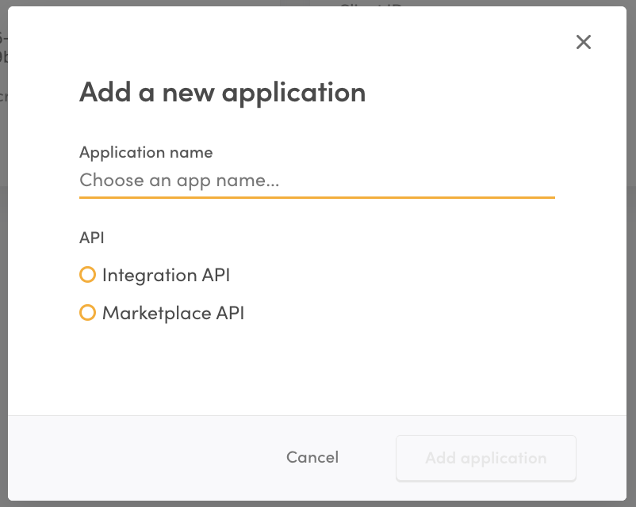

import { Callout } from 'nextra/components';

# Applications

Applications are used to manage the credentials you use to access the
Sharetribe APIs.

## Add a new application

In Sharetribe, accessing the
[Marketplace API or the Integration API](/concepts/api-sdk/marketplace-api-integration-api/)
starts with creating an
[_application_](https://console.sharetribe.com/advanced/applications).

Creating an application will provide you with the Client ID and a Client
Secret. These credentials are used to
[authenticate](/concepts/api-sdk/authentication-api/) via the
Authentication API. Using an Access Token returned by the Authentication
API, you can make calls to the Marketplace API and the Integration API.

Applications come in two types: Marketplace API applications and
Integration API applications. Both types of applications have both a
client ID and a client secret. As a general rule, the client ID can be
considered public information, while the client secret must always be
kept secure.

## Best practices

- Create a separate application for each of your systems that access the
  Sharetribe APIs. For example, if you have a web and a mobile app,
  create two separate Marketplace API applications.
- Name your applications so that it is easier for you to recognize how
  each one is used. For instance, use names like "Web UI", "iOS mobile
  app", "reporting", "mailing list integration", etc.
- When an application is deleted, all API clients using the associated
  Client ID and Secret will stop working.

<Callout type="warning">

Always keep your applications' client secret secure. Never expose it in
a untrusted device or application, such as end users' browsers or mobile
apps.

</Callout>
