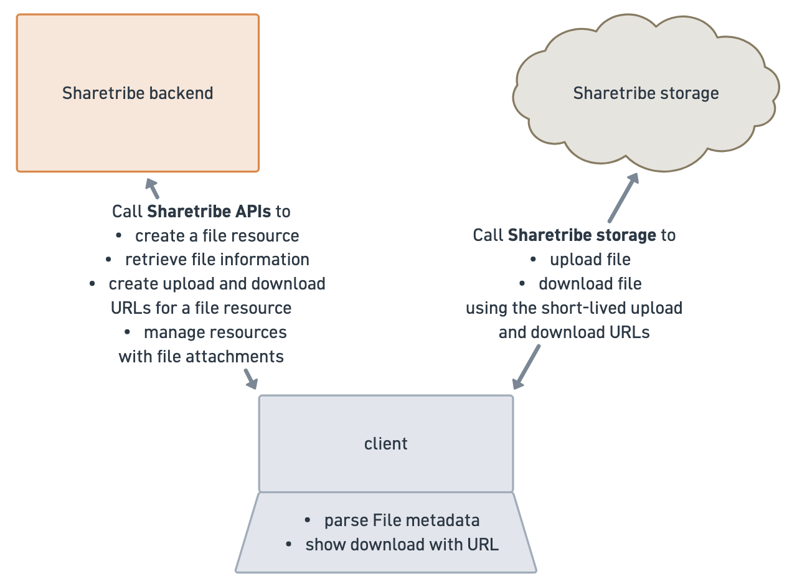

# Files in Sharetribe

Sharetribe supports uploading and downloading files and attaching them
to different marketplace resources.

The file information and relationships to other resources is stored in
the Sharetribe backend and available through the Sharetribe APIs. The
file entities themselves are stored in a third-party storage, and you
need to call the Sharetribe APIs to request unique signed upload and
download URLs to access the actual file entities.



## Permissions

Uploading and downloading files is enabled by default. Operators can
disable uploading and downloading files across the marketplace in Access
control. When uploads and downloads are disabled in Console > General >
Access control,
[file upload and download endpoints](/concepts/users-and-authentication/user-access-control-in-sharetribe/#disabling-file-uploads-and-downloads)
will throw a 403 Forbidden error.

In addition, you can use for instance listing types to enable or disable
specific use cases for files in your marketplace, if files are enabled.

## File and FileAttachment

In the Sharetribe system, `file` and `fileAttachment` represent two
different things:

- A `file` represents a single uploaded digital file resource
- A `fileAttachment` is a file's connection to another resource, such as
  a message.

A `file` is a related resource to a `fileAttachment`, and a
`fileAttachment` is a related resource of another resource, for example
a message. In this structure, it is possible for a `file` to have
`fileAttachment` links to multiple different resources.

When querying the resource, you'll need to include both the file
attachments relationship and the nested file relationship if you want to
retrieve both.

```js
const messages = await sdk.messages.query({
  transaction_id: txId,
  include: ['publicFileAttachments', 'publicFileAttachments.file'],
});
```

```js
// messages.query API response with included
// publicFileAttachments and publicFileAttachments.file
{
  "data": [
    {
      "id": {
        "uuid": "69fd886a-96b2-4ba1-b458-cda5fdc0616e"
      },
      "type": "message",
      "attributes": {
        "content": "message content",
        "createdAt": "2026-05-08T06:53:30.043Z",
        "deleted": false
      },
      // publicFileAttachments is a relationship to message
      "relationships": {
        "publicFileAttachments": {
          "data": [
            {
              "id": {
                "uuid": "69fd886a-1924-41c5-bfe1-a43deb7e1c3b"
              },
              "type": "fileAttachment"
            }
          ]
        }
      }
    }
  ],
  "included": [
    {
      // this is the file resource that has a relationship to fileAttachment
      "id": {
        "uuid": "69fd8859-8380-49c0-ab7e-0ee502e40811"
      },
      "type": "file",
      "attributes": {
        "name": "File to be uploaded.pdf",
        "state": "available",
        "mimeType": "application/pdf",
        "size": 10697,
        "deleted": false
      }
    },
    // This message has one fileAttachment in its publicFileAttachments array
    {
      "id": {
        "uuid": "69fd886a-1924-41c5-bfe1-a43deb7e1c3b"
      },
      "type": "fileAttachment",
      "attributes": {
        "scope": "public",
        "deleted": false
      },
      // file is a relationship to fileAttachment
      "relationships": {
        "file": {
          "data": {
            "id": {
              "uuid": "69fd8859-8380-49c0-ab7e-0ee502e40811"
            },
            "type": "file"
          }
        }
      }
    }
  ],
  "meta": {
    "totalItems": 1,
    "totalPages": 1,
    "page": 1,
    "perPage": 100
  }
}
```

An operator can delete a file attachment to disconnect a resource from a
file, or they can delete the file itself so that all resources linked to
the file lose access. When attaching files to messages, a single file is
only attached to a single message at a time, so when an operator deletes
a file associated with a message, both the `fileAttachment` and the
`file` are deleted.

## ownFile and file

A `file` can have multiple states:

- pendingUpload
- pendingVerification
- available
- verificationFailed.

File resources are immutable, so updating an existing file resource is
not possible.

To fetch a public `file` resource, you'll need to use the id of the
associated `fileAttachment`, as the `fileAttachment` resource contains
the scope information that informs whether the API caller should have
access to the resource.

```js
const file = await sdk.files.show({ fileAttachmentId }).data.data;
```

```json
"file": {
  "id": {
    "uuid": "69fd8859-8380-49c0-ab7e-0ee502e40811"
  },
  "type": "file",
  "attributes": {
    "name": "File to be uploaded.pdf",
    "state": "available",
    "mimeType": "application/pdf",
    "size": 10697,
    "deleted": false
  }
}
```

There's also an `ownFile` resource, which is the author's expanded
version of the file. In addition to the public attributes, the
`ownFile`resource also shows when the resource was created and when the
state was updated.

To fetch an `ownFile`resource, you'll need to use the id of the `file`
resource, not the file attachment resource.

```js
const ownFile = await sdk.ownFiles.show({ id: fileId }).data.data;
```

```json
"ownFile": {
  "id": {
    "uuid": "69fd8859-8380-49c0-ab7e-0ee502e40811"
  },
  "type": "ownFile",
  "attributes": {
    "name": "File to be uploaded.pdf",
    "mimeType": "application/pdf",
    "size": 10697,
    "state": "available",
    "createdAt": "2026-05-08T06:53:13.091Z",
    "stateUpdatedAt": "2026-05-08T06:53:25.880Z"
  }
}
```

## Visibility

A file is first uploaded by creating an `ownFile` resource, which is
visible to the creator of the resource. An `ownFile` can then be
attached to another resource.

Once a file has been attached to another resource, it becomes also
visible as a `file` resource according to the scope of the corresponding
fileAttachments attribute:

- `publicFileAttachments` are visible to all users who have access to
  the resource in question
- `protectedFileAttachments` are visible to the user who created the
  resource, and additionally the file can be revealed in a transaction
  to the other transaction participant
- `privateFileAttachments` are visible only to the user who created the
  resource.

You can review the
[API reference](https://www.sharetribe.com/api-reference/) to see which
resources have which scopes of file attachments available.

In addition, operators have visibility to files and file attachments in
Console. For example, files attached to messages are visible in the
Console transaction details.

## File storage

Files are both uploaded to and downloaded from storage directly using
pre-signed URLs – not using Sharetribe API endpoints.

For uploads, this means that a user first creates the file resource in
Sharetribe, and then fetches a time-limited signed URL connected to that
specific file resource that allows uploading the file to storage.

```js
const uploadDetails = sdk.fileUploads.create({ fileId }).data.data;
```

```json
"uploadDetails": {
  "id": {
    "uuid": "63abdec4-85e7-4157-8e99-2e2c7465d8be"
  },
  "type": "fileUpload",
  "attributes": {
    "fileId": {
      "uuid": "69fd8859-8380-49c0-ab7e-0ee502e40811"
    },
    "url": "https://unique-signed-sharetribe-upload-url.com",
    "headers": {
      "Content-Type": "application/pdf"
    },
    "method": "PUT",
    "expiresAt": "2026-05-08T08:16:30.988Z"
  }
}
```

For downloads, the user makes a POST request for a short-lived download
URL for the file from Sharetribe API, and uses that generated URL to
fetch the file from storage. There are two different download endpoints
that use different ids, similarly to how files/show and own_files/show:

- own_file_downloads/create (sdk.ownFileDownloads.create) for ownFile
  resources, where the parameter is the `file` id
- file_downloads/create (sdk.fileDownloads.create) for file resources,
  where the parameter is the `fileAttachment` id

```js
const downloadDetails = isOwnFile
  ? sdk.ownFileDownloads.create({ fileId }).data.data
  : sdk.fileDownloads.create({ fileAttachmentId }).data.data;
```

```json
"downloadDetails": {
  "id": {
    "uuid": "fd76299c-1be6-4250-8de6-10b1d8f9cb9e"
  },
  "type": "fileDownload",
  "attributes": {
    "fileId": {
      "uuid": "69fd8859-8380-49c0-ab7e-0ee502e40811"
    },
    "url": "https://unique-signed-sharetribe-download-url.com",
    "expiresAt": "2026-05-08T08:29:28.089Z"
  }
}
```

Since both upload URLs and download URLs are short-lived, it's not
possible to save them in a resource's extended data for reuse. Both
resources have an `expiresAt` attribute that indicates how long they are
valid.

## Security

When a file is uploaded, the Sharetribe backend runs a security
verification to ensure that the file is safe to handle and distribute,
for example that it does not have malware. In addition, the backend
verifies that the file mime type is acceptable and the size is less than
1GB.

Files can be attached to resources once they've been uploaded, even if
they have not yet been verified. The Sharetribe backend processes the
verification asynchronously, and the file becomes available if the
verification succeeds. If you want to show the file as available
immediately when verification succeeds, your client will need to poll
the file to determine when it becomes available.
