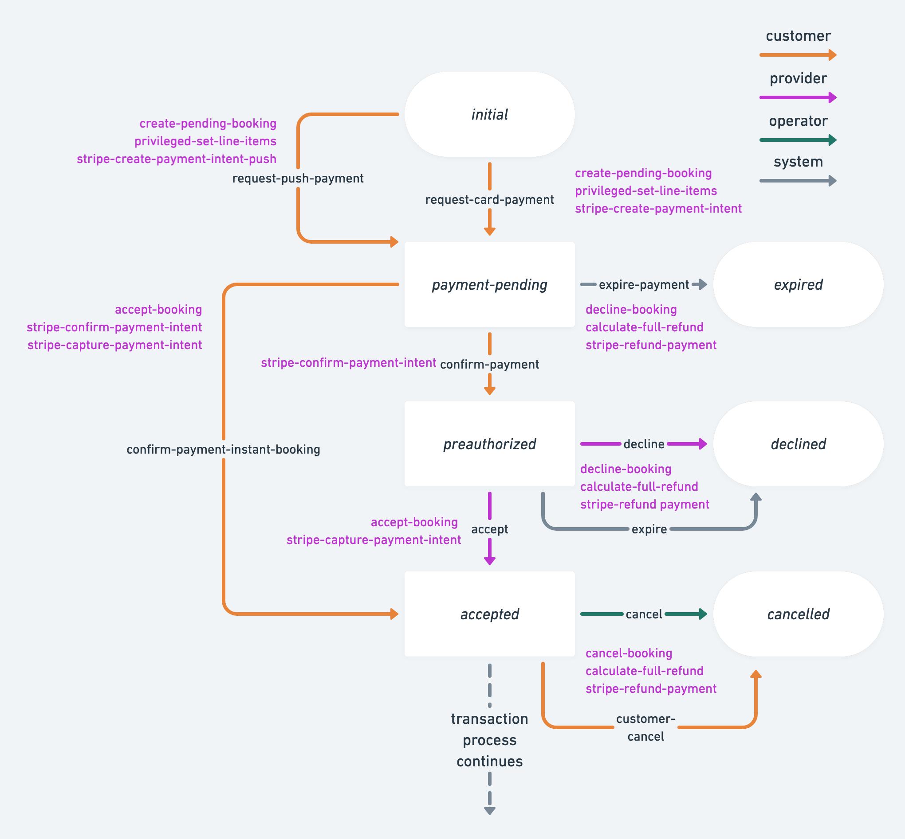

import { Callout } from 'nextra/components';
import { Steps } from 'nextra/components';

# How PaymentIntents work with the Sharetribe Stripe integration

## Introduction

[PaymentIntents](https://stripe.com/docs/payments/payment-intents) are a
mechanism provided by Stripe to track the lifecycle of customer checkout
flow. In addition, PaymentIntents provide tools for
[Strong Customer Authentication (SCA)](/concepts/payments/strong-customer-authentication/)
where required. Sharetribe has built-in support for PaymentIntents and
Strong Customer Authentication.

PaymentIntents provide fraud prevention with things like
[3D Secure Card Payments](https://stripe.com/docs/payments/3d-secure),
and allow a variety of payment methods to be used when making a payment
in Sharetribe. See the
[overview of supported payment methods in Sharetribe](/concepts/payments/payment-methods-overview/).

This article describes how PaymentIntents relate to Sharetribe
transaction process payment logic, as well as the general principles of
implementing a checkout flow with PaymentIntents.

## Transaction process with PaymentIntents

On high level, the payment flow with PaymentIntents has the following
steps:

1. Customer initiates or transitions a transaction with a transition
2. Customer uses the PaymentIntent data to complete any steps necessary
   to authenticate and authorize the payment.
3. The transaction can proceed only after customer has authorized (if
   required) the payment. The PaymentIntent is confirmed, resulting in a
   Charge being preauthorized (in the case of
   [card payments](/concepts/payments/payment-methods-overview/#card-payment-flow))
   or fully captured (in the case of
   [push payment methods](/concepts/payments/payment-methods-overview/#push-payment-flow)).
4. Transaction flow continues with the next appropriate transition.

### Example transaction process with card payments


For technical implementation of PaymentIntents, Stripe offers two
approaches -
[manual or automatic confirmation flow](https://stripe.com/docs/payments/payment-intents#one-time-payments).
Sharetribe uses the automatic flow. In practice, the Sharetribe
transaction engine models the automatic flow with two transitions. First
transition creates the PaymentIntent (Step 1.) and second transition
will validate and mark it confirmed in Sharetribe (Step 3.). Between
these steps, the automatic flow pushes the responsibility of
authenticating, authorizing and confirming the payment in Stripe to the
client application (Step 2.). More information on the Step 2. can be
found in this [section](#required-actions-in-the-client).

### Example transaction process with both card and push payments



Since push payments
[do not have a preauthorization stage](/concepts/payments/payment-methods-overview/#push-payment-flow),
this process allows an instant-booking type of flow, where the booking
does not need acceptance from the provider.

You can find another example process with only an _instant booking_ flow
and support for both card and push payments in the
[Instant booking process](https://github.com/sharetribe/example-processes#instant-booking)
in the
[Sharetribe example transaction processes repository](https://github.com/sharetribe/example-processes).

## Actions related to PaymentIntents

The following actions can be attached to a transaction process in order
to implement PaymentIntent flow and are already present in the default
flows.

### stripe-create-payment-intent

Creates a PaymentIntent for use with card payments (or payment methods
that are similar, such as Google Pay or Apple Pay). You can optionally
pass in a
[PaymentMethod](https://stripe.com/docs/payments/payment-methods) ID, or
attach a PaymentMethod later to the transaction during the validation
and confirmation in the client by using Stripe Elements. The latter
option is what we recommend you use.

For detailed reference, see
[here](/references/transaction-process-actions/#actionstripe-create-payment-intent).

### stripe-create-payment-intent-push

Creates a PaymentIntent for use with push payments. You can optionally
pass in a
[PaymentMethod](https://stripe.com/docs/payments/payment-methods) ID, or
attach a PaymentMethod later to the transaction during the validation
and confirmation in the client by using Stripe Elements. The latter
option is what we recommend you use.

For detailed reference, see
[here](/references/transaction-process-actions/#actionstripe-create-payment-intent-push).

### stripe-confirm-payment-intent

Validates that the transaction has a PaymentIntent created and verifies
via Stripe API that the PaymentIntent status is `requires_capture`,
`requires_confirmation` or `succeeded` (only allowed for push payment
methods). Confirms the PaymentIntent in Stripe, if needed.

If the payment intent was created with `stripe-create-payment-intent` (a
card payment), a preauthorization is placed on the card. The payment
then can be captured in full by using `stripe-capture-payment-intent`
within 7 days of creating the payment intent, or the preauthorization
can be released by using `stripe-refund-payment`.

On the other hand, if the payment intent was created with
`stripe-create-payment-intent-push`, there is no preauthorization, the
payment is captured in full and there is no need to use the
`stripe-capture-payment-intent` action. The payment can be refunded in
full using the `stripe-refund-payment`.

For detailed reference, see
[here](/references/transaction-process-actions/#actionstripe-confirm-payment-intent).

### stripe-capture-payment-intent

Captures a confirmed PaymentIntent. In case of PaymentIntents created
through `stripe-create-payment-intent-push`, the PaymentIntent is
automatically captured already when confirmed and this action has no
effect. Note that uncaptured payment intents are valid for seven days,
after which they are automatically canceled by Stripe.

For detailed reference, see
[here](/references/transaction-process-actions/#actionstripe-capture-payment-intent).

### stripe-refund-payment

Either cancels an unconfirmed PaymentIntent or refunds the related
captured charge.

For detailed reference, see
[here](/references/transaction-process-actions/#actionstripe-refund-payment).

## Required actions in the client

The required actions in the client are related to authentication and
confirmation. You need to be able to handle potential authentication
steps required by the customer's card issuing bank. After
authentication, the client needs to obtain PaymentIntent data from the
transaction's protected data
([as described in step 2 below](#step-2-collect-payment-information-and-handle-customer-actions))
and use that to confirm the payment.

<Callout type="important">
  These steps are already implemented in the Sharetribe Web Template.
</Callout>

In case you want to enforce
[3D Secure Card Payments](https://stripe.com/docs/payments/3d-secure)
for cards that support 3DS, in addition to supporting payment
authentication in your client app, you may need to update your
[Stripe Radar rules](https://stripe.com/docs/payments/3d-secure#three-ds-radar).

### Handling Strong Customer Authentication

[Strong Customer Authentication](https://stripe.com/en-fi/payments/strong-customer-authentication)
is a potential step enforced by governmental regulation. Not every
PaymentIntent for card payments will require customer authentication.
For instance, authentication may not be required for:

- transactions out of scope of SCA
- e.g. when card issuing bank is outside of EEA
- merchant initiated transactions
- transactions that fall under an SCA exemption
- low value or low risk transactions
- recurring payments for fixed amount
- other

In addition, PaymentIntents for push payment methods also require
customer action. Typically, the customer needs to be redirected to their
bank website or app where they can complete the payment, after which
they get redirected back to the marketplace.

This means that Sharetribe implementation of PaymentIntents supports
payment flows that require authentication and those that do not. When
implementing the PaymentIntent flow in the client you need to be
prepared for handling both cases - payments requiring SCA and payments
that do not. It might be impossible to know in advance whether the
payment will require authentication, unless the marketplace and all its
customers are outside of EEA.

The recommended way of implementing support for SCA is to use
[Stripe Elements](https://stripe.com/docs/payments/payment-intents/quickstart)
that can provide you with ready modals for handling e.g. 3D Secure Card
Payments. The next section will provide high level instructions on how
to do this in the client.

### Implementing the PaymentIntent flow

For implementing the PaymentIntent flow, you can use the following
guides as a reference:

- [card payments](https://stripe.com/docs/payments/accept-a-payment)
- push payment methods:
  - [Alipay](https://stripe.com/docs/payments/alipay/accept-a-payment)
  - [Bancontact](https://stripe.com/docs/payments/bancontact/accept-a-payment)
  - [EPS](https://stripe.com/docs/payments/eps/accept-a-payment)
  - [giropay](https://stripe.com/docs/payments/giropay/accept-a-payment)
  - [iDEAL](https://stripe.com/docs/payments/ideal/accept-a-payment)
  - [Przelewy24](https://stripe.com/docs/payments/p24/accept-a-payment)

Below we outline the concrete steps and how they work in combination
with the Sharetribe transaction process.

<Steps>

#### Initiate or transition a Sharetribe transaction

With Sharetribe, the step to create a PaymentIntent in handled by the
transaction engine when a transaction transitions with a transition
using one of the following actions:

- [stripe-create-payment-intent](#stripe-create-payment-intent) - use
  this action for card payments
- [stripe-create-payment-intent-push](#stripe-create-payment-intent-push) -
  use this action for payments with push payment methods

If we assume that your transaction process has two initiating
transitions, as in the image below,  
you would use the `request-card-payment` transition for card payments
and the `request-push-payment` transition for push payments.


#### Collect payment information and handle customer actions

[Stripe Elements](https://stripe.com/docs/stripe-js) provides ready
tools and a reference for implementing the automatic PaymentIntent flow.
It is useful for both collecting payment details, attaching the
PaymentMethod to the PaymentIntent, as well as handling any customer
payment authentication or confirmation steps. It's the recommended way
to support PaymentIntents in the client.

For card payments, your implementation will typically invoke a call to
Stripe.js
[stripe.confirmCardPayment](https://stripe.com/docs/js/payment_intents/confirm_card_payment).

For push payments, the correct Stripe.js method depends on the concrete
payment system. See [here](https://stripe.com/docs/js/payment_intents)
for a full list of Stripe.js methods.

In either case, you need the PaymentIntent's ID and client secret. Both
of those values are exposed in the transaction's protectedData map under
a key `stripePaymentIntents` after the PaymentIntent has been created.
The value of `stripePaymentIntents` is an object in the form of:

```json
{
  "default": {
    "stripePaymentIntentId": "pi_1EXSEzLSea1GQQ9x5PnNTeuS",
    "stripePaymentIntentClientSecret": "pi_1EXSEzLSea1GQQ9x5PnNTeuS_secret_Qau2uE5J5L6baPs8eLPMa2Swb"
  }
}
```

This data is only exposed to the customer in the transaction. The
provider can not access the PaymentIntent ID or the client secret.

#### Transition the Sharetribe transaction further

Once any customer authentication or payment confirmation is handled in
the UI, you need to transition the Sharetribe transaction further in
order for Sharetribe to record the payment details correctly. Make sure
that the transition includes the
[stripe-confirm-payment-intent](#stripe-confirm-payment-intent) action.

If we assume that your transaction process uses both card and push
payments as in the image below, you would use the `confirm-payment`
transition for card payments and the `confirm-payment-instant-booking`
transition for push payments.


</Steps>

## Further reading

- [Payment methods overview](/concepts/payments/payment-methods-overview/)

* [Transaction process](/concepts/transactions/transaction-process/)
* [Action reference for Stripe integration](/references/transaction-process-actions/#stripe-integration)
* [Editing transaction process](/how-to/transaction-process/edit-transaction-process-with-sharetribe-cli/)
* [Changing transaction process setup in Sharetribe Web Template](/how-to/transaction-process/change-transaction-process-in-template/)
