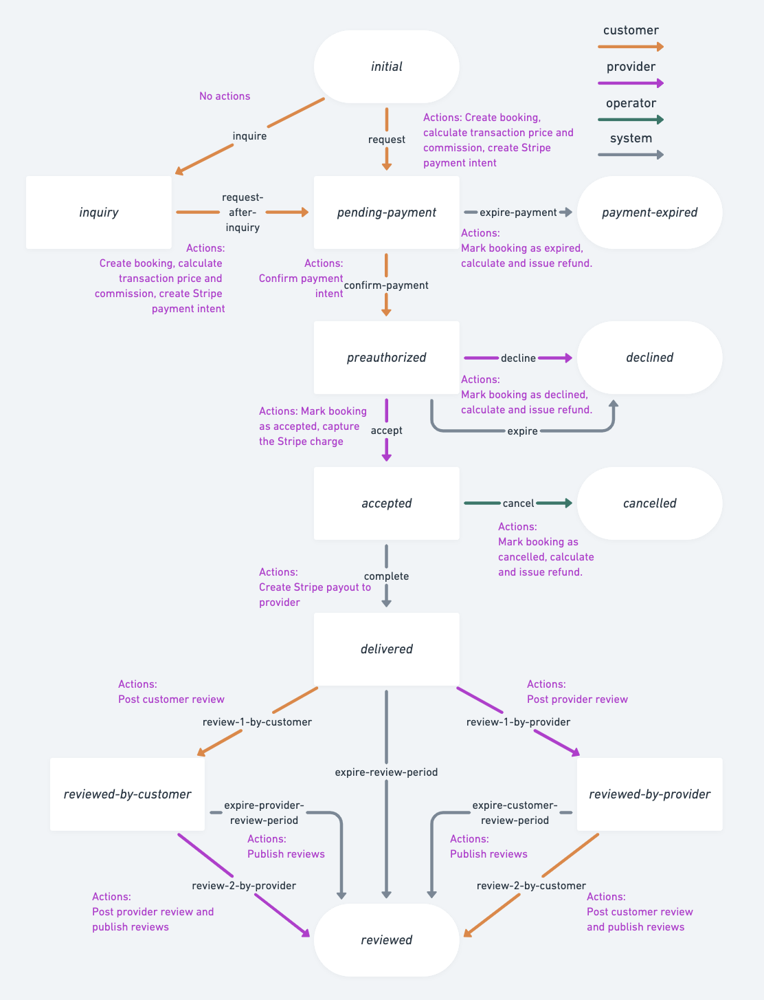
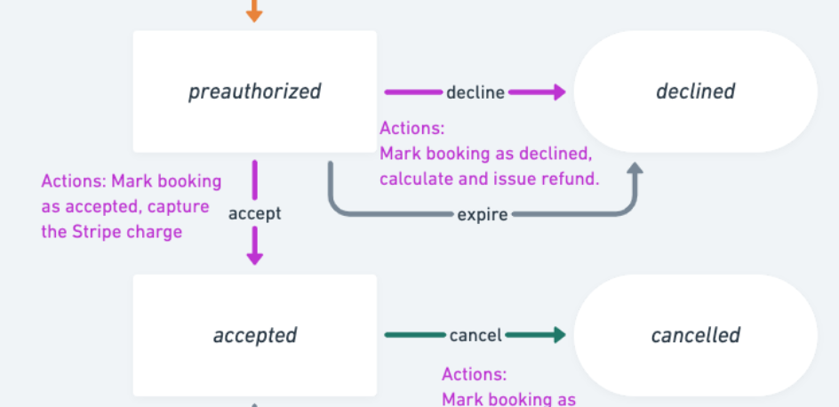
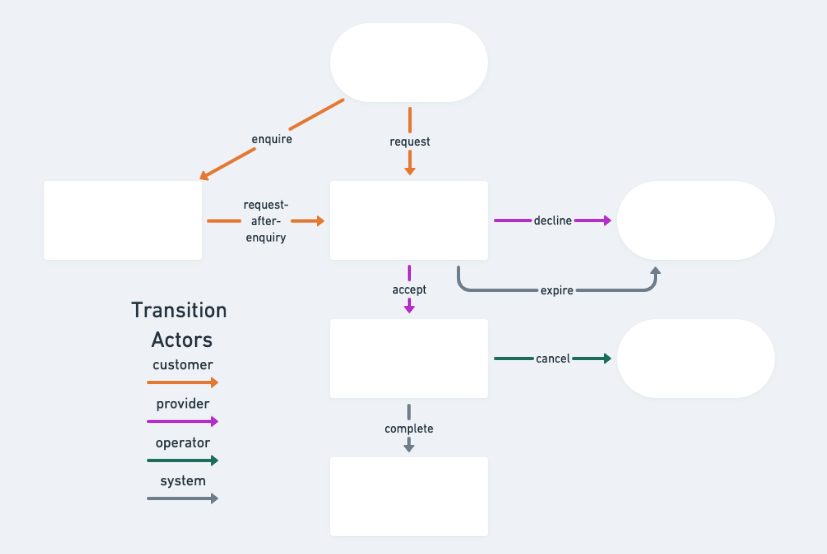
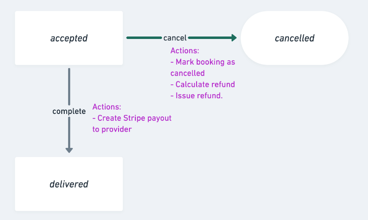
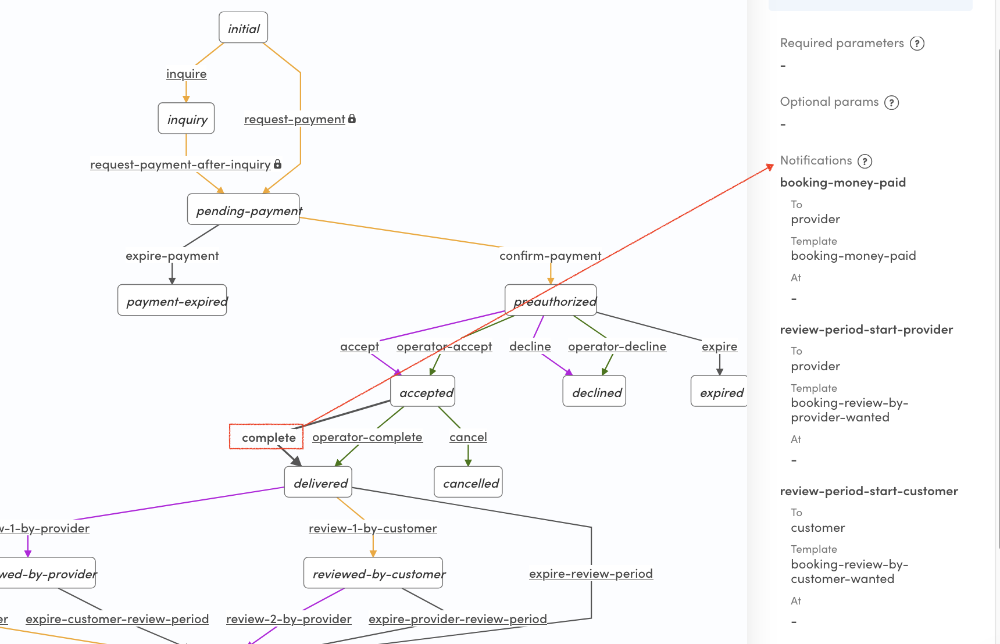
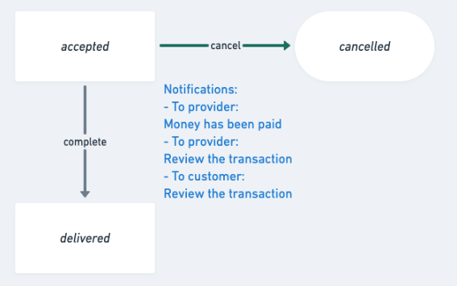
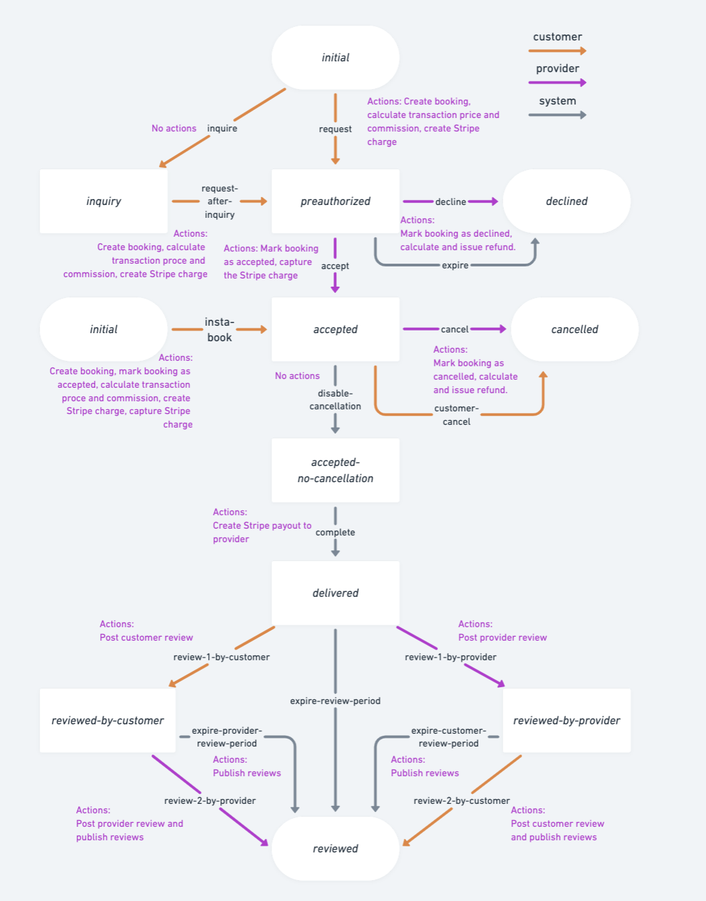

import { Callout } from 'nextra/components';

# Introduction to transaction processes

Your marketplace exists to connect supply and demand. There are
countless ways of making this connection happen, so Sharetribe allows
you to customize your transaction process to make different types of
transaction configurations possible.

## Users interact through transactions

Any time users connect with each other on a Sharetribe marketplace, they
do it through a transaction. At its core, a Sharetribe transaction is
the interaction between two users — the provider and the customer — from
beginning to end. A single transaction might include events such as
messages between users, the payment sent from the customer to the
provider, and the reviews users leave about their experience.

On different marketplaces, users transact in different ways. For
instance, you may want your providers to accept requests before
confirming bookings to ensure that there is no conflict. Or, you might
prefer requests to confirm automatically because you want to prioritize
speed. Perhaps you’d like both options, depending on the nature of the
offered service.

The guidelines for how you’d like users to transact are established in
Sharetribe using a transaction process. Your marketplace’s transaction
process determines how your customers and providers move through their
transaction. You can also have different transaction processes for
different ways of transacting, like renting and buying products, in the
same marketplace.

A transaction follows the trail established by your transaction process.
The transaction process maps the steps your users will complete and the
possibilities they have upon reaching each step.

Your marketplace can have multiple different transaction processes in
use simultaneously. You can see the transaction processes of your
marketplace in
[Sharetribe Console](https://console.sharetribe.com/advanced/transaction-processes).

Typically, all transaction processes are different. These differences
can be fundamental and change the logic of the order flow, or they can
be small and superficial.

An example of a fundamental difference is choosing whether the users
book

- by night or by day, as when booking a hotel room
- by seat, as when booking tickets to an event
- by hour, as when booking a hairdresser
- or not at all, as when booking is handled outside the marketplace.

Another fundamental difference between transaction processes would be
the direction of the transaction flow: does your marketplace use

- a regular flow, where a provider creates a listing and a customer
  makes a booking or purchase
- or a reverse flow, where a customer creates a listing and a provider
  submits an offer.

Out of the default processes in a Sharetribe marketplace,
`default-negotiation` supports both regular and reverse flows. The other
default processes only support a regular flow. You can custom develop a
process that supports either flow, or both of them.

A smaller variation could be, for example, deciding if the provider has
to always accept the booking before it can be confirmed or if the
booking is automatically confirmed as soon as it is made (i.e. instant
booking). Another small variation could be a change of wording in a
notification email sent to remind the customer of their upcoming
booking.

## Transaction process building blocks

Each transaction process guides how your users interact in your
marketplace. Each process is built with a few building blocks that
describe what is going on. These building blocks are called **states**,
**transitions**, and **actions**. Let’s explore a transaction process
modeled on AirBnB to learn more about them.



In the image above you can see one of the default transaction processes
in Sharetribe called "default-booking". It is the same process that you
will find, albeit with a different layout, within your Console account's
[transaction process page](https://console.sharetribe.com/advanced/transaction-processes).
It closely mimics how a customer and a provider transact on AirBnB. From
a listing, customers can message a provider or book directly by entering
their payment details and authorizing the charge on their card.
Providers must then either accept the request, reject the request, or
let it expire.

After an accepted booking is completed, the customer and provider have a
certain period of time to review each other. After this, the reviews are
published and the transaction is concluded.

The default processes are built in to Sharetribe Web Template. Usually,
the easiest way to start defining your own transaction process is by
editing the default process.

<Callout type="info">

In Sharetribe, transaction processes are written in Clojure's edn
format, and there are a handful of examples written in edn in this
article. If you are not familiar with edn, you can learn more in this
article:

- [The edn format](/concepts/development/edn/)

</Callout>

### States

The status at any given point in a transaction is called its **state**.
The state describes where the users are in their transaction.

The Sharetribe default booking process, for example, has a state called
_preauthorized_. It signifies that a customer has requested to book a
time from the provider’s calendar, and a charge on their credit card has
been preauthorized.



Transaction processes are defined in a **process.edn** file of the
process directory. In the process.edn file, states are not defined
directly. Instead, they are defined as the _:from_ and _:to_ states of
transitions:

```clojure filename="process.edn"
    {:name :transition/confirm-payment,
    :actor :actor.role/customer
    :actions [{:name :action/stripe-confirm-payment-intent}],
    :from :state/pending-payment ;; :from state describes the initial state of the transition
    :to :state/preauthorized} ;; to state describes the final state of the transition

```

From the _preauthorized_ state the provider can reject or accept the
request, in which case the transaction will transition to the _declined_
or _accepted_ state respectively.

```clojure filename="process.edn"
    {:name :transition/accept
    :actor :actor.role/provider
    :actions [{:name :action/accept-booking}
              {:name :action/stripe-capture-payment-intent}]
    :from :state/preauthorized
    :to :state/accepted}

    {:name :transition/decline
    :actor :actor.role/provider
    :actions [{:name :action/decline-booking}
              {:name :action/calculate-full-refund}
              {:name :action/stripe-refund-payment}]
    :from :state/preauthorized
    :to :state/declined}
```

### Transitions

Transitions move the transaction from one state to another. They are the
steps between states.

A transition is triggered by one type of user or “actor”: the customer,
the provider, the operator, or time (this is known as the “system” actor
in Sharetribe, or as an automatic transition). From the accepted state
in the transaction, the transaction will automatically transition to a
delivered state at a certain point in time. Or, the operator may cancel
the booking.

Transitions describe the possible next steps from a particular state.
They also describe who can complete the steps. If there are no possible
transitions from a state, the transaction has ended.

Technically, transitions can be considered the main building block of
Sharetribe transaction process. They define, implicitly or explicitly,
all the other elements of a transaction process. We will not go to into
more detail in this article, but you can find more information
[in the transaction process format reference documentation.](/references/transaction-process-format/)



```clojure filename="process.edn"
  ;; These two transitions go from state/preauthorized to state/declined,
  ;; but one is allowed for the provider, and one is scheduled to run at a specified time
  {:name :transition/decline
  :actor :actor.role/provider
  :actions [{:name :action/decline-booking}
            {:name :action/calculate-full-refund}
            {:name :action/stripe-refund-payment}]
  :from :state/preauthorized
  :to :state/declined}

  {:name :transition/expire
  ;; the :at parameter replaces the :actor parameter in scheduled transitions
  :at {:fn/min [{:fn/plus [{:fn/timepoint [:time/first-entered-state :state/preauthorized]}
                            {:fn/period ["P6D"]}]}
                {:fn/plus [{:fn/timepoint [:time/booking-end]}
                            {:fn/period ["P1D"]}]}]}
  :actions [{:name :action/decline-booking}
            {:name :action/calculate-full-refund}
            {:name :action/stripe-refund-payment}]
  :from :state/preauthorized
  :to :state/declined}
```

### Actions

Actions describe what happens as part of a transition. For example, the
transaction process allows users to transition from accepted state to
delivered or cancelled. The transaction may “complete” automatically, or
the operator may “cancel” it with the respective transitions. “Complete”
actions involve creating a payout to the provider via Stripe
(Sharetribe’s payment gateway). “Cancel” actions, on the other hand,
include cancelling the booking and issuing a refund.

Possible actions are defined by the capacity of the Sharetribe API. The
list of all transaction process actions can be found
[in the transaction process actions reference documentation](/references/transaction-process-actions/).

<Callout type="warning">
  Creating custom actions is not possible.
</Callout>



```clojure filename="process.edn"
  {:name :transition/complete
  :at {:fn/timepoint [:time/booking-end]}
  ;; actions:
  ;; - create Stripe payout to provider
  :actions [{:name :action/stripe-create-payout}]
  :from :state/accepted
  :to :state/delivered}

  {:name :transition/cancel
  :actor :actor.role/operator
  ;; actions:
  ;; - mark booking as cancelled
  ;; - calculate refund
  ;; - issue refund
  :actions [{:name :action/cancel-booking}
            {:name :action/calculate-full-refund}
            {:name :action/stripe-refund-payment}]
  :from :state/accepted
  :to :state/cancelled}
```

### Notifications

Notifications specify the content and behavior of emails sent during a
transaction.They determine which actor receives them; define what email
template is used; and schedule the specific sending time. Email
notifications are triggered by the completion of a transition. The email
templates used for the notifications are also considered part of the
transaction process, and can be fully customised to fit the needs of the
marketplace.

In the Sharetribe default booking process, transitioning from the
accepted to the delivered state triggers three email notifications. The
provider receives a notification that their money has been paid out and
a notification prompting them to review the customer. The customer
receives an email notification to review the provider.

To review what notifications are sent as part of the Sharetribe default
processes, visit your
[Sharetribe Console](https://www.sharetribe.com/help/en/articles/8501778-how-sharetribe-console-works)
_> Build > Advanced > Transaction process visualiser,_ and view a
specific process version. You can see the notifications associated with
each transition in the transition's details by clicking the transition
name.



Each included
[email notification has a template](/references/email-templates/#editing-transaction-emails)
that can be customized using the Sharetribe CLI. You can also edit the
content of the transaction notifications in the Console, under Build >
Content > Email texts.



```clojure filename="process.edn"
  {:name :notification/booking-money-paid,
   :on :transition/complete,
   :to :actor.role/provider,
   :template :booking-money-paid}
  {:name :notification/review-period-start-provider,
   :on :transition/complete,
   :to :actor.role/provider,
   :template :booking-review-by-provider-wanted}
  {:name :notification/review-period-start-customer,
   :on :transition/complete,
   :to :actor.role/customer,
   :template :booking-review-by-customer-wanted}
```

## What kind of transaction process customizations are possible?

As all marketplaces’ have their own characteristics, it is common to
need some customization to the default transaction process to make it
more suitable to the customers’ needs.

However, quite often it's helpful to start building your process by
making slight customizations to the default process. Typical minor
customizations for transaction process are adding the possibility for a
customer to cancel a booking or a booking request, adding operator
transitions, or editing the contents of the email templates used for the
notifications.



Another common example is to modify the process so that the provider has
to manually mark the booking as completed and the rented goods as
returned in good condition. This might be useful in rental marketplaces
where the goods that are rented are of high value. In another case, the
process could be modified so that the operator can close down the
transaction process in case that there is trouble in the order flow.
This could be done for example in cases where a customer has booked a
time from a professional, but doesn’t appear in the meeting.

Apart from the order flow, customizations can also affect the money
flow, storing
[protected data](/references/extended-data/#protected-data) or sending
notifications.

## Start creating your own transaction process

The transaction process determines how your users transact on your
marketplace. It maps where your users are in a transaction, what
possible next steps they have, and how those steps are taken. The
transaction process plays out in your marketplace application where your
users transact.

Now that you understand more about how the transaction process works,
it’s time to create your own. Sharetribe provides a few default
processes, but you’ll likely want to modify these to capture the unique
way your users will transact.

You can build your transaction process using the Sharetribe CLI. Here
are guides for [creating your own transaction process](TODO) and for
[getting started with Sharetribe CLI](/introduction/getting-started-with-sharetribe-cli/).
For more details of the transaction process format, see the
[Transaction process format](/references/transaction-process-format/)
reference. To customise the UI of your marketplace to match your process
changes, see the
[Change transaction process setup in Sharetribe Web Template](/how-to/transaction-process/change-transaction-process-in-template/)
how-to guide.
