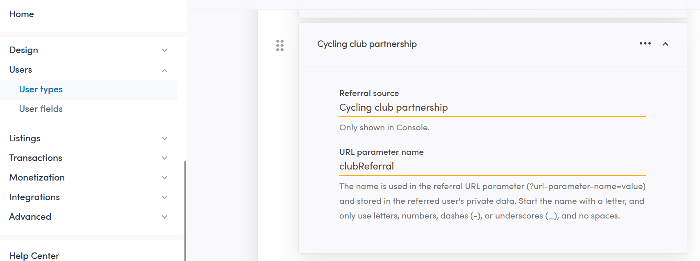

import { Callout } from 'nextra/components';

# Referral links in Sharetribe

Referral links allow operators to track how new users arrive at the
marketplace. When a user follows a referral link, the referral
parameters in the URL are validated against the referral sources
configured for each user type in Console. If the user then signs up
before the expiry window, the referral data is saved to their private
data.

## Configuring referrals in Console

Referral sources are configured per user type in Console, so a referral
link is only valid for users who match the expected user type on
sign-up.



For more information on setting up referrals, refer to the
[Help Center article](https://www.sharetribe.com/help/en/articles/15478987-how-referral-sources-work).

## How referral links work

Referral data is captured from the URL on any page load, meaning any
page on the marketplace can serve as an entry point for a referral link.
In pages where the URL directly impacts API query parameters - for
example the search page - the referral link is filtered out of the
params before the query is made.

A referral link uses the URL parameter name defined in Console combined
with a referral code. For example, a referral link for a cycling club
partnership might look like this:

```
/signup?clubReferral=referral-code
```

<Callout type="warning">
  If your custom search code passes URL parameters directly to API
  queries - for example, by spreading `location.search` params into a
  listings query - referral link parameters may be unintentionally
  included. Filter them out before making API calls. See
  [SearchPage.duck.js](https://github.com/sharetribe/web-template/blob/main/src/containers/SearchPage/SearchPage.duck.js)
  for an example of how the template handles this.
</Callout>

### Persisting referral data

When referral parameters are found in the URL, they are saved to local
storage as referral data. The referral data persists for 90 days, so a
user can follow a referral link and sign up at a later point within that
window and still have the referral captured.

### Validation and sign-up

When a user signs up, the referral data stored in local storage is
validated against the referral sources defined for each user type in
Console. The referral sources for a user type are structured as follows:

```json
{
  "userType": "seller",
  "referralSources": [
    {
      "label": "Cycling club partnership",
      "parameter": "clubReferral"
    }
  ]
}
```

If the referral data is valid and the user matches the expected user
type, the referral data is saved to the user's private data.

If the referral data is invalid, or the user's type does not match the
referral source, sign-up proceeds normally and no referral data is
saved.
