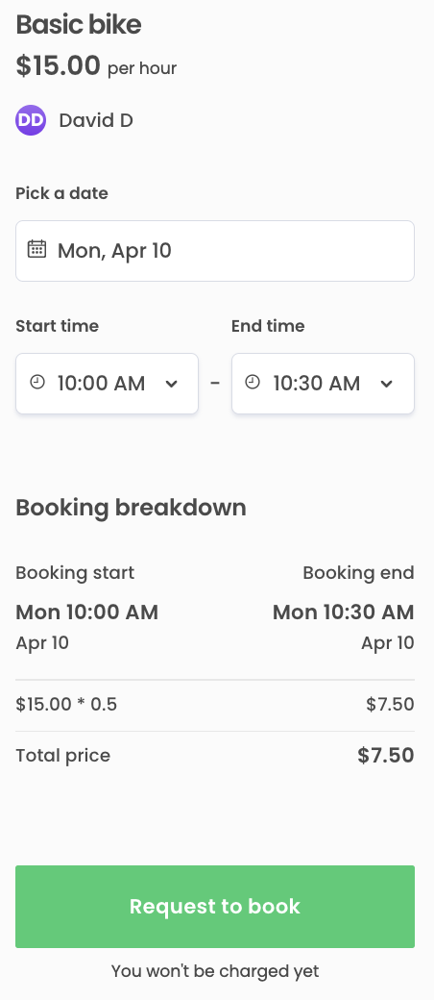
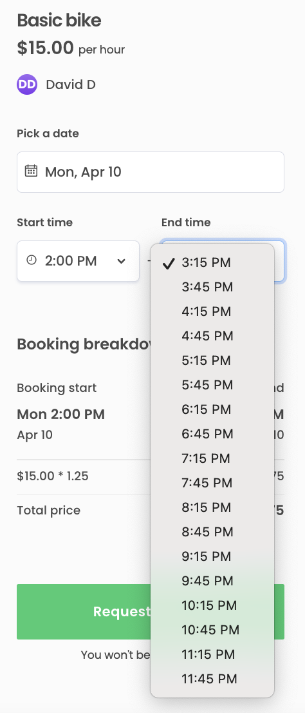

import { Callout, FileTree } from 'nextra/components';

# Modify booking time intervals in time-based listings

In Sharetribe, listings can have either day-based or time-based
availability. For listings with time-based availability, the available
[time slots](https://www.sharetribe.com/api-reference/marketplace.html#time-slots)
are returned from the API as continuous stretches of time. The client
application must therefore split the availability into suitable booking
lengths.

The default behavior of the Sharetribe Web Template hourly listings is
to split the continuous availability stretch into one hour bookable
intervals. This how-to guide illustrates a handful of different cases on
modifying booking lengths. These changes apply to all listings where the
unit type is set to "hour".

<Callout type="info">

Starting with Sharetribe Web Template
[v8.0.0](https://github.com/sharetribe/web-template/releases/tag/v8.0.0),
the template also supports fixed timeslots, where the provider can
choose the length of possible bookings, and the customer only selects a
start time for their booking. This guide applies to non-fixed time
slots, where the customer can select multiple intervals of the available
booking length by setting a start time and an end time.

</Callout>

## Set booking length to 30 minutes

The simplest use case is to create uniform 30 minute booking slots.
Start with adding a constant for the booking length in minutes.

```jsx filename="src/util/dates.js"
const timeSlotMinutes = 30;
```

Time slot handling is done using a few helper functions in
`src/util/dates.js`

<FileTree>
  <FileTree.Folder name="src" defaultOpen>
    <FileTree.Folder name="util" defaultOpen>
      <FileTree.File name="dates.js" />
    </FileTree.Folder>
  </FileTree.Folder>
</FileTree>

- `getStartHours` and `getEndHours` return a list of timepoints that are
  displayed as the booking's possible start and end moments,
  respectively. They both use the same helper function `getSharpHours`
- `getSharpHours` retrieves the sharp hours that exist within the
  availability time slot. It uses the `getBoundaries` function and
  passes in hard-coded 1 hour time increments.
- The `getBoundaries` function fetches the boundaries for bookable slots
  based on a given time unit. It calls the `findBookingUnitBoundaries`
  function.
- `findBookingUnitBoundaries` is a recursive function that checks
  whether the current boundary (e.g. sharp hour or custom time span)
  passed to it falls within the availability time slot.
  - If the current boundary is within the availability time slot, the
    function calls itself with the next boundary and cumulates the
    boundary results into an array.
  - If the current boundary does not fall within the availability time
    slot, the function returns the cumulated results from the previous
    iterations.
  - `findBookingUnitBoundaries` takes a `nextBoundaryFn` parameter that
    it uses to determine the next boundary value to pass to itself.
- the function passed as `nextBoundaryFn` is `findNextBoundary`. The
  `findNextBoundary` function increments the current boundary by a
  predefined value, both for custom time units and for the default ones
  – day and hour.

```jsx filename="src/util/dates.js" showLineNumbers{718}
export const findNextBoundary = (
  currentDate,
  unitCount,
  timeUnit,
  timeZone
) => {
  const customTimeUnitConfig = bookingTimeUnits[timeUnit]?.isCustom
    ? bookingTimeUnits[timeUnit]
    : null;

  if (!!customTimeUnitConfig) {
    // If the time unit is custom, we need to use startOfMinuteBasedInterval function to adjust 00, 15, 30, 45 rounding.
    const customTimeUnitInMinutes =
      customTimeUnitConfig?.timeUnitInMinutes;
    const minuteOffset = !!customTimeUnitInMinutes
      ? unitCount * customTimeUnitInMinutes
      : unitCount;

    return moment(currentDate)
      .clone()
      .tz(timeZone)
      .add(minuteOffset, 'minute')
      .startOfMinuteBasedInterval(customTimeUnitInMinutes)
      .toDate();
  } else {
    // Other time units are handled with the default moment.js functions
    return moment(currentDate)
      .clone()
      .tz(timeZone)
      .add(unitCount, timeUnit)
      .startOf(timeUnit)
      .toDate();
  }
};
```

### Use the custom extension function for moment.js

The template hourly listing handling uses the
[moment-timezone](https://momentjs.com/timezone/) library to modify
times and dates and convert them between the listing's time zone and the
user's time zone.

By default, the `findNextBoundary` function uses
`moment.startOf(timeUnit)` to round the booking slots to the top of each
hour or day. For custom time slots, the function uses customized
moment.js extension `startOfMinuteBasedInterval()`, which is defined
earlier in the same `dates.js` file.

```jsx filename="src/util/dates.js"
moment.fn.startOfMinuteBasedInterval = function (unitCount) {
  const durationInMs = moment
    .duration(unitCount, 'minutes')
    .asMilliseconds();

  // Calculate the number of durations since 1970-01-01 00:00:00
  const durationCount = Math.floor(this.valueOf() / durationInMs);
  // Return a moment that is rounded to the start of the previous whole number of durations
  return moment(durationCount * durationInMs);
};
```

It is added to `moment.js` using the prototype exposed through
`moment.fn`, so that we can chain it in the same place as the default
`startOf(timeUnit)` function.

### Add a new block for handling customized time slots

You will need to create a new `else if` block for the hourly unit type,
where you use the `startOfMinuteBasedInterval` function instead of the
default `startOf(timeUnit)` function, and pass the `timeSlotMinutes`
value as the addition and rounding duration values.

```jsx filename="src/util/dates.js" {25-32}
export const findNextBoundary = (
  currentDate,
  unitCount,
  timeUnit,
  timeZone
) => {
  const customTimeUnitConfig = bookingTimeUnits[timeUnit]?.isCustom
    ? bookingTimeUnits[timeUnit]
    : null;

  if (!!customTimeUnitConfig) {
    // If the time unit is custom, we need to use startOfMinuteBasedInterval function to adjust 00, 15, 30, 45 rounding.
    const customTimeUnitInMinutes =
      customTimeUnitConfig?.timeUnitInMinutes;
    const minuteOffset = !!customTimeUnitInMinutes
      ? unitCount * customTimeUnitInMinutes
      : unitCount;

    return moment(currentDate)
      .clone()
      .tz(timeZone)
      .add(minuteOffset, 'minute')
      .startOfMinuteBasedInterval(customTimeUnitInMinutes)
      .toDate();
  } else if (timeUnit === 'hour') {
    // Replace hourly handling with the defined booking length
    return moment(currentDate)
      .clone()
      .tz(timeZone)
      .add(timeSlotMinutes, 'minute')
      .startOfMinuteBasedInterval(timeSlotMinutes)
      .toDate();
  } else {
    // Other time units are handled with the default moment.js functions
    return moment(currentDate)
      .clone()
      .tz(timeZone)
      .add(unitCount, timeUnit)
      .startOf(timeUnit)
      .toDate();
  }
};
```

For listings with an hourly price, the server-side function
`calculateQuantityFromHours` in [server/api-util/lineItemHelpers.js]()
determines the correct quantity as a decimal of full hours. However, if
you want to set a price per minute, or e.g. a price per non-hour
session, you will need to modify `calculateQuantityFromHours` in that
file as well.



<Callout type="info">

Note that this change also changes the time intervals available for
modifying a listing's availability exceptions.

If you want to continue handling availability exceptions with full
hours, you can introduce a parameter `useFullHours = true` and pass it
down the following path:

- `getStartHours` to `getSharpHours`
- `getEndHours` to `getSharpHours`
- `getSharpHours` to `getBoundaries`
- `getBoundaries` to `findBookingUnitBoundaries` and the
  `findNextBoundary` function defined as `currentBoundary`
- `findBookingUnitBoundaries` to the `nextBoundaryFn` call defined as
  `currentBoundary`

In `findNextBoundary`, replace the `else if (timeUnit === 'hour')`
condition with `else if (!useFullHours)`

Finally, you'll need to modify `FieldDateAndTimeInput.js` usages of
`getStartHours` and `getEndHours` to pass `false` for the `useFullHours`
parameter, so that they use your modified handling instead.

</Callout>

## Use an irregular time slot

If your marketplace has custom booking lengths longer than (and not
divisible by) 30 minutes, you will need to extend the previous steps to
a more complex approach to make sure the time slots show up correctly.

### Find the rounding duration

When the booking length is not a factor of a full hour, using the
`timeslotMinutes` value might cause issues, because the start time slot
gets rounded to a multiple of the time slot in general. This means that
depending on the start time of the availability (8 AM vs 9 AM vs 10 AM),
the first time slot may show up as starting 15 minutes or half hour past
the actual desired start time.

To align the first available boundary with a sharp hour, we need to
manually set the first boundary to the specified start time, and set
rounding to a factor of a full hour.

To determine the correct rounding minute amount, we calculate the
greatest common factor of the booking length and a full hour using the
[Euclidean algorithm](https://en.wikipedia.org/wiki/Euclidean_algorithm).
For instance, when using a 45 minute time slot, the greatest common
divisor with an hour is 15 minutes.

```jsx filename="src/util/dates.js"
const timeSlotMinutes = 45;
const hourMinutes = 60;

/**
 * Calculate the greatest common factor (gcf) of two timeslot lengths
 * to determine rounding value using the Euclidean algorithm
 * (https://en.wikipedia.org/wiki/Euclidean_algorithm).
 */
const gcf = (a, b) => {
  return a ? gcf(b % a, a) : b;
};

/**
 * Define the rounding value.
 * If the first time slot is shorter than general time slot,
 * swap the parameters around so that the first parameter is the shorter one
 */
const rounding = gcf(timeSlotMinutes, hourMinutes);
```

### Manually set first boundary to start time

To manually set the first boundary to the start time, we need to pass an
`isFirst` parameter to the `findNextBoundary` function. For the first
time slot, we then skip incrementing completely. The rounding function
now rounds the start time back to the rounding boundary.

The default start time is passed to `findNextBoundary` as one
millisecond before start time, since the default addition of 30 minutes
and the `startOfDuration(...)` function cancel each other out. Now that
we want to set the first booking slot manually, we also need to revert
that millisecond change in our modified handling.

```diff filename="src/util/dates.js"
- export const findNextBoundary = (currentDate, unitCount, timeUnit, timeZone) => {
+ export const findNextBoundary = (currentDate, unitCount, timeUnit, timeZone, isFirst = false) => {
  const customTimeUnitConfig = bookingTimeUnits[timeUnit]?.isCustom
    ? bookingTimeUnits[timeUnit]
    : null;
  ...
  } else if (timeUnit === 'hour') {
+   // Add separate handling for the first timeslot so that bookings can start
+   // from the beginning of the available time slot
+   const increment = isFirst ? 0 : timeSlotMinutes;
+   // Revert the millisecondBeforeStartTime change if increment is 0, so that the rounding
+   // works correctly
+   const date = isFirst ? new Date(currentDate.getTime() + 1) : currentDate;

    // Replace hourly handling with the defined booking length
-   return moment(currentDate)
+   return moment(date)
      .clone()
      .tz(timeZone)
-     .add(timeSlotMinutes, 'minutes')
-     .startOfMinuteBasedInterval(timeSlotMinutes)
+     .add(increment, 'minutes')
+     .startOfMinuteBasedInterval(rounding)
      .toDate();
  } else {
    // Other time units are handled with the default moment.js functions
    return moment(currentDate)
    ...
```

Then, in the `getBoundaries` function that calls `findNextBoundary`, we
will need to pass `true` as the `isFirst` parameter to the very first
`findBookingUnitBoundaries` function call.

```diff filename="src/util/dates.js"
export const getBoundaries = (startTime, endTime, unitCount, timeUnit, timeZone, intl) => {
  ...
  const millisecondBeforeStartTime = new Date(startTime.getTime() - 1);
  return findBookingUnitBoundaries({
+   // Add isFirst param to determine first time slot handling
-   currentBoundary: findNextBoundary(millisecondBeforeStartTime, 1, timeUnit, timeZone),
+   currentBoundary: findNextBoundary(millisecondBeforeStartTime, 1, timeUnit, timeZone, true),
    startMoment: moment(startTime),
    endMoment: moment(endTime),
    ...
```

## Add separate handling for first timeslot

Sometimes, there are cases where you want to have a basic length for a
booking and then different lengths for subsequent time slots. For
instance, a listing could feature a 75 minute default bike rental with
the option to extend it for 30 minutes at a time. In those cases, you
need to create different handling for the first time slot, i.e. the
first start and end boundaries.

```jsx filename="src/util/dates.js"
const timeSlotMinutes = 30;
const firstSlotMinutes = 75;

/**
 * Define the rounding value.
 * If the first time slot is shorter than general time slot,
 * swap the parameters around so that the first parameter is the shorter one
 */
const rounding = gcf(timeSlotMinutes, firstSlotMinutes);
```

### Determine first time slot boundaries

In this use case, we want to determine a different behavior for the
start and end boundaries of the first time slot. For this reason, we
need to pass an `isStart` parameter to `findNextCustomBoundary` and use
it to determine the boundary timepoints in addition to the `isFirst`
parameter.

```diff filename="src/util/dates.js"
export const findNextBoundary = (
  currentDate,
  unitCount,
  timeUnit,
  timeZone,
- isFirst = false
+ isFirst = false,
+ isStart = false,
) => {
  ...
  } else if (timeUnit === 'hour') {
    // Add separate handling for the first timeslot so that bookings can start
    // from the beginning of the available time slot
+   // Use the default booking length for non-first slots
+   // Use the first booking length for first end boundary
+   // Use 0 for first start boundary
-   const increment = isFirst ? 0 : timeSlotMinutes;
+   const increment = !isFirst
+     ? timeSlotMinutes
+     : !isStart
+     ? firstSlotMinutes
+     : 0;
+
    // Revert the millisecondBeforeStartTime change if increment is 0, so that the rounding
    // works correctly
    const date = isFirst ? new Date(currentDate.getTime() + 1) : currentDate;
    ...
};
```

The `getBoundaries` and `getSharpHours` functions are used for both
start hours and end hours, so we need to receive `isStart` as a
parameter in both, and pass the value on to `findNextBoundary`.

```diff filename="src/util/dates.js"
  export const getBoundaries = (
    startTime,
    endTime,
    unitCount,
    timeUnit,
    timeZone,
    intl,
+   isStart = false
  ) => {
    if (!moment.tz.zone(timeZone)) {
...
    return findBookingUnitBoundaries({
-   // Add isFirst param to determine first time slot handling
-   currentBoundary: findNextBoundary(millisecondBeforeStartTime, 1, timeUnit, timeZone, true),
+   // Add isFirst and isStart params to determine first time slot handling
+   currentBoundary: findNextBoundary(millisecondBeforeStartTime, 1, timeUnit, timeZone, true, isStart),
      startMoment: moment(startTime),
```

```diff filename="src/util/dates.js"
- export const getSharpHours = (startTime, endTime, timeZone, intl) => {
+ export const getSharpHours = (startTime, endTime, timeZone, intl, isStart) => {
-   return getBoundaries(startTime, endTime, 1, 'hour', timeZone, intl);
+   return getBoundaries(startTime, endTime, 1, 'hour', timeZone, intl, isStart);
};
```

### Customize start hour and end hour list behavior

By default, `getStartHours` and `getEndHours` basically retrieve the
same list, but `getStartHours` removes the last entry and `getEndHours`
removes the first entry. Since we have custom start and end handling in
`findNextBoundary`, we also need to modify the start and end hour lists.

To get correct start times, we need to first pass `true` as the
`isStart` parameter from `getStartHours` to `getSharpHours`.

In addition, we need to make sure that even when selecting the last
start time, there is enough availability for the first timeslot. We do
this by removing enough entries from the end so that the first time slot
can be booked even from the last start moment.

```diff filename="src/util/dates.js"
export const getStartHours = (startTime, endTime, timeZone, intl) => {
-  const hours = getSharpHours(startTime, endTime, timeZone, intl);
+  const hours = getSharpHours(startTime, endTime, timeZone, intl, true);

- return hours.length < 2 ? hours : hours.slice(0, -1);
+ // Remove enough start times so that the first slot length can successfully be
+ // booked also from the last start time
+ const removeCount = Math.ceil(firstSlotMinutes / timeSlotMinutes)
+ return hours.length < removeCount ? [] : hours.slice(0, -removeCount);
};
```

Finally, we can simplify the end hour handling. Since the first entry is
determined in the `findNextCustomBoundary` function, we do not need to
remove it. Instead, we can just return the full list from
`getSharpHours`.

```diff filename="src/util/dates.js"
export const getEndHours = (startTime, endTime, timeZone, intl) => {
-  const hours = getSharpHours(startTime, endTime, timeZone, intl);
-  return hours.length < 2 ? [] : hours.slice(1);
+  return getSharpHours(startTime, endTime, timeZone, intl);
};
```

We can then see that after the first booking length of 75 minutes, the
subsequent boundaries are 30 minutes each.


