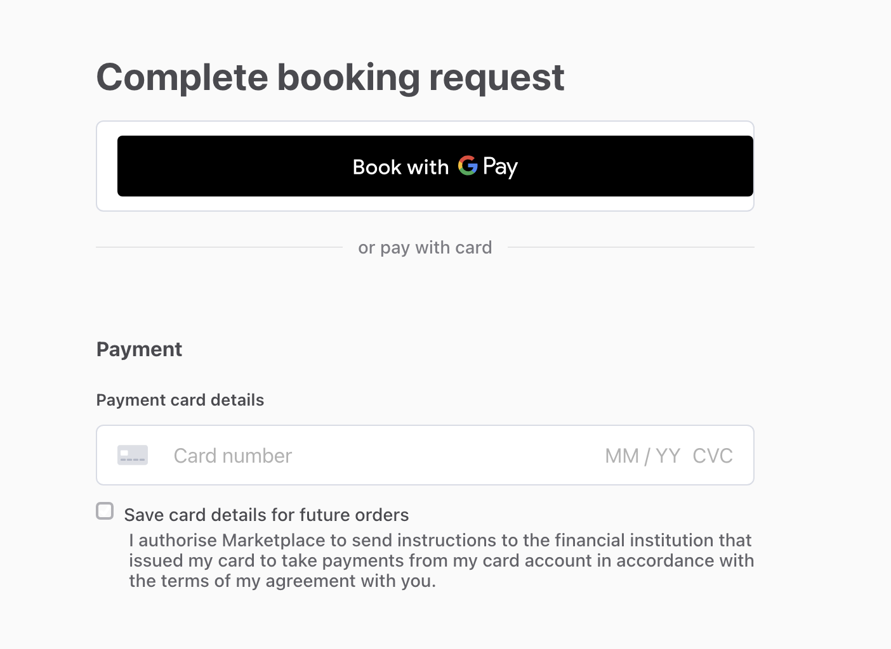

import { FileTree, Steps, Callout } from 'nextra/components';

# How to integrate Payment Request Button for Apple Pay and Google Pay

The Sharetribe Stripe integration supports using card wallets such as
Google Pay and Apple Pay without transaction process changes, when using
the Payment Request Button. This guide shows you how to integrate the
Payment Request Button on your Sharetribe Web Template checkout page.

## Why Payment Request Button

Stripe's own documentation recommends using
[Express Checkout Element](https://docs.stripe.com/elements/express-checkout-element)
or [Payment Element](https://docs.stripe.com/payments/payment-element)
in new integrations. However, neither of those elements is easily
compatible with the Sharetribe Stripe default integration:

- The Express Checkout Element does not directly support
  [manual capture](https://docs.stripe.com/payments/place-a-hold-on-a-payment-method),
  and the Sharetribe backend creates payment intents with
  `capture_method: manual` to support preauthorizing the funds while a
  transaction is waiting for the provider to accept or decline.
- The Payment Element collects payment details through Stripe Elements
  using automatic payment methods i.e. with a Payment Element internal
  logic. The Sharetribe backend creates the payment intent with a
  `payment_method_types` parameter that defines what payment method
  types are allowed to complete the payment intent. The confirm function
  stripe.confirmPayment expects the Payment Element to set the payment
  methods instead of the payment intent, so it is incompatible with
  Sharetribe-created payment intents.

The
[Payment Request Button](https://docs.stripe.com/stripe-js/elements/payment-request-button)
is a Stripe Element for displaying wallet payment methods that avoids
these pitfalls. It works with manual capture, so it avoids the issue
with Express Checkout Element. In addition, it uses the same
`stripe.confirmCardPayment` function as the default card payment flow,
so it does not have the same confirm issue as the Payment Element.

In this guide, we'll add Payment Request Button to
CheckoutPageWithPayment.

You will notice that a lot of the structures for Payment Request Button
parallel the existing structures for card payments, so being familiar
with the existing card payment flow is useful but not required.

### Prerequisites

Before you start developing this feature, make sure you have taken the
following steps to prepare.

<Steps>

#### Serve your application over HTTPS.

The Payment Request Button does not mount over plain HTTP. For local
development, use a tunnel such as [ngrok](https://ngrok.com/).

<Callout type="info">

When you're using the `yarn run dev-server` command to run the template,
this command overwrites the `REACT_APP_MARKETPLACE_ROOT_URL` specified
in the .env file. Ensure you update the command to match the URL where
your site is being served through Ngrok.

</Callout>

#### Register your domain

Register your domain with Stripe in both sandbox and live mode
[according to these instructions](https://docs.stripe.com/payments/payment-methods/pmd-registration).
The button will not appear on unregistered domains.

#### Add a card to a wallet on the device and browser you will test with

With Chrome, the Google Pay interface will automatically show up when
you are using test keys. Make sure that your Chrome settings aren't
blocking cookies and that you're using Standard (not enhanced)
protection.

Safari will not allow testing with Stripe Test keys, since it is not
possible to add a Stripe test card in your Apple Wallet. This means that
you will need to develop the feature with another browser and then test
with Safari once you are using Live keys.

#### Add a server endpoint to fetch the provider's Stripe Connect account

The payment request initialisation requires the Stripe Connect account
id that matches the on_behalf_of account in the Payment Intent. The
Marketplace API does not expose the attribute at the moment, so you will
need to add a server-side endpoint that

- verifies the request is coming from an authenticated marketplace user
- calls the Integration API users.show with the provider's id
- and then returns the provider's Stripe Connect account id to the
  client.

You'd then need to pass on the Stripe Connect account as a prop to the
StripePaymentForm component, where the payment request is initialised.
This implementation expects the attribute as `providerStripeAccountId`.

</Steps>

## Add Payment Request Button

### Add Stripe country to config

To create `stripe.paymentRequest`, we need the country code of the
platform operator's Stripe account.

First, add your country code in your .env file as
`REACT_APP_STRIPE_COUNTRY`:

```shell filename=".env"
REACT_APP_STRIPE_COUNTRY=DE;
```

Add that as an export in `src/config/configStripe.js`. Include a
fallback value so a missing env variable does not silently break the
Payment Request Button initialization.

<FileTree>
  <FileTree.Folder name="src" defaultOpen>
    <FileTree.Folder name="config" defaultOpen>
      <FileTree.File name="configStripe.js" active />
    </FileTree.Folder>
  </FileTree.Folder>
</FileTree>

```jsx filename="configStripe.js"
export const country = process.env.REACT_APP_STRIPE_COUNTRY || 'US';
```

### Extend `confirmCardPayment` in stripe.duck.js

The `confirmCardPaymentPayloadCreator` function builds `args` as either
`[secret]` or `[secret, paymentParams]` in the default implementation.

Payment Request Button uses two-phase confirmation. This means that a
third branch for `[secret, paymentParams, confirmOptions]` is needed for
the Payment Request Button flow, since it requires passing
`{ handleActions: false }` as a third argument to the
`stripe.confirmCardPayment` thunk on the first call.

<FileTree>
  <FileTree.Folder name="src" defaultOpen>
    <FileTree.Folder name="ducks" defaultOpen>
      <FileTree.File name="stripe.duck.js" active />
    </FileTree.Folder>
  </FileTree.Folder>
</FileTree>

Add `confirmOptions` to the destructuring of `params`, then replace the
two-branch ternary with a three-branch version:

```diff filename="src/ducks/stripe.duck.js"
 const confirmCardPaymentPayloadCreator = async (params) => {
-  const { stripe, paymentParams, stripePaymentIntentClientSecret: secret } = params;
+  const { stripe, paymentParams, confirmOptions, stripePaymentIntentClientSecret: secret } = params;

-  const args = paymentParams ? [secret, paymentParams] : [secret];
+  const args =
+    paymentParams && confirmOptions
+      ? [secret, paymentParams, confirmOptions]
+      : paymentParams
+      ? [secret, paymentParams]
+      : [secret];

   return stripe.confirmCardPayment(...args);
 };
```

### Add `processCheckoutWithPRBPayment` to CheckoutPageTransactionHelpers.js

The default card payment flow uses a function called
`processCheckoutWithPayment` to handle the card payment steps. We will
add a parallel function, called `processCheckoutWithPRBPayment`, that
uses a similar flow but for Payment Request Button specific steps.

<FileTree>
  <FileTree.Folder name="src" defaultOpen>
    <FileTree.Folder name="containers" defaultOpen>
      <FileTree.Folder name="CheckoutPage" defaultOpen>
        <FileTree.File
          name="CheckoutPageTransactionHelpers.js"
          active
        />
      </FileTree.Folder>
    </FileTree.Folder>
  </FileTree.Folder>
</FileTree>

The function composes the first three async steps from
`processCheckoutWithPayment`, but replaces the standard card
confirmation with a two-phase Payment Request Button confirmation:

- `fnRequestPayment` is identical to the card flow. It calls
  `onInitiateOrder`, handles the inquiry/negotiation/standard transition
  branches, and persists the transaction.

- `fnConfirmCardPaymentPRB` is the two-phase Payment Request Button
  confirmation mentioned in the previous step.
  1. The first call uses `{ handleActions: false }` and
     `payment_method: ev.paymentMethod.id`. If it fails, it calls
     `ev.complete('fail')` before throwing. If it succeeds, the flow
     calls `ev.complete('success')` to close the payment sheet, and then
     checks whether the second call is necessary.

  2. A second call is made if
     `paymentIntent.status === 'requires_action'` – for example to
     handle 3DS or other actions required by the payment intent.

- `fnConfirmPayment` — identical to the card flow. It transitions the
  transaction using the Marketplace API.

The `processCheckoutWithPayment` function has a fourth step for saving a
default payment method. However, wallet payment methods cannot be saved
as default, so we don't include that step. Instead, we add a `.then`
block to the composed function to return a correctly shaped response.

Add this new helper function to `CheckoutPageTransactionHelpers.js`:

```jsx filename="src/containers/CheckoutPage/CheckoutPageTransactionHelpers.js"
export const processCheckoutWithPRBPayment = (
  orderParams,
  extraPaymentParams
) => {
  const {
    ev, // Stripe paymentmethod event object
    hasPaymentIntentUserActionsDone,
    onConfirmCardPayment,
    onConfirmPayment,
    onInitiateOrder,
    pageData,
    paymentIntent,
    process,
    setPageData,
    sessionStorageKey,
    stripe,
  } = extraPaymentParams;

  const storedTx = ensureTransaction(pageData.transaction);
  const processAlias =
    pageData?.listing?.attributes?.publicData?.transactionProcessAlias;

  let createdPaymentIntent = null;

  // Step 1: fnRequestPayment – identical to processCheckoutWithPayment
  const fnRequestPayment = (fnParams) => {
    const hasPaymentIntents =
      storedTx.attributes.protectedData?.stripePaymentIntents;

    const isOfferPendingInNegotiationProcess =
      resolveLatestProcessName(processAlias.split('/')[0]) ===
        NEGOTIATION_PROCESS_NAME &&
      storedTx.attributes.state ===
        `state/${process.states.OFFER_PENDING}`;

    const requestTransition =
      storedTx?.attributes?.lastTransition ===
      process.transitions.INQUIRE
        ? process.transitions.REQUEST_PAYMENT_AFTER_INQUIRY
        : isOfferPendingInNegotiationProcess
          ? process.transitions.REQUEST_PAYMENT_TO_ACCEPT_OFFER
          : process.transitions.REQUEST_PAYMENT;
    const isPrivileged = process.isPrivileged(requestTransition);

    const orderPromise = hasPaymentIntents
      ? Promise.resolve(storedTx)
      : onInitiateOrder(
          fnParams,
          processAlias,
          storedTx.id,
          requestTransition,
          isPrivileged
        );

    orderPromise.then((order) => {
      persistTransaction(
        order,
        pageData,
        storeData,
        setPageData,
        sessionStorageKey
      );
    });

    return orderPromise;
  };

  // Step 2: PRB two-phase confirmation, replaces fnConfirmCardPayment
  const fnConfirmCardPaymentPRB = async (fnParams) => {
    const order = fnParams;

    const hasPaymentIntents =
      order?.attributes?.protectedData?.stripePaymentIntents;
    if (!hasPaymentIntents) {
      throw new Error(
        `Missing StripePaymentIntents key in transaction's protectedData. Check that your transaction process is configured to use payment intents.`
      );
    }

    const { stripePaymentIntentClientSecret } =
      order.attributes.protectedData.stripePaymentIntents.default;

    // If PI user actions are already done (e.g. a previous attempt succeeded),
    // close the sheet and pass through
    if (hasPaymentIntentUserActionsDone) {
      ev.complete('success');
      return { transactionId: order?.id, paymentIntent };
    }

    // First call: confirm PI attaching the PRB payment method, without handling
    // any required actions. This returns quickly so ev.complete() can be called promptly.
    let firstResult;
    try {
      firstResult = await onConfirmCardPayment({
        stripe,
        stripePaymentIntentClientSecret,
        paymentParams: { payment_method: ev.paymentMethod.id },
        confirmOptions: { handleActions: false }, // extended in Step 2 above
        orderId: order?.id,
      });
    } catch (err) {
      // Confirmation failed — tell the browser to re-show the payment interface
      ev.complete('fail');
      throw err;
    }

    // Close the browser payment sheet before handling any further actions.
    // Must be called promptly; Stripe will timeout if delayed.
    ev.complete('success');

    createdPaymentIntent = firstResult.paymentIntent;

    // Second call: handle 3DS or other required actions if the PI needs them.
    if (firstResult.paymentIntent?.status === 'requires_action') {
      const secondResult = await onConfirmCardPayment({
        stripe,
        stripePaymentIntentClientSecret,
        orderId: order?.id,
        // No paymentParams, no confirmOptions — let Stripe handle the action
      });
      createdPaymentIntent = secondResult.paymentIntent;
      return {
        transactionId: order?.id,
        paymentIntent: secondResult.paymentIntent,
      };
    }

    return {
      transactionId: order?.id,
      paymentIntent: firstResult.paymentIntent,
    };
  };

  // Step 3: complete order – identical to processCheckoutWithPayment
  const fnConfirmPayment = (fnParams) => {
    createdPaymentIntent = fnParams.paymentIntent;
    const transactionId = fnParams.transactionId;
    const transitionName = process.transitions.CONFIRM_PAYMENT;
    const isTransitionedAlready =
      storedTx?.attributes?.lastTransition === transitionName;
    const orderPromise = isTransitionedAlready
      ? Promise.resolve(storedTx)
      : onConfirmPayment(transactionId, transitionName, {});

    orderPromise.then((order) => {
      persistTransaction(
        order,
        pageData,
        storeData,
        setPageData,
        sessionStorageKey
      );
    });

    return orderPromise;
  };

  const applyAsync = (acc, val) => acc.then(val);
  const composeAsync =
    (...funcs) =>
    (x) =>
      funcs.reduce(applyAsync, Promise.resolve(x));
  const handlePRBPaymentIntentCreation = composeAsync(
    fnRequestPayment,
    fnConfirmCardPaymentPRB,
    fnConfirmPayment
  );

  return handlePRBPaymentIntentCreation(orderParams).then((order) => ({
    orderId: order?.id,
    paymentMethodSaved: true,
  }));
};
```

### Update StripePaymentForm.js

The Payment Request Button logic lives inside `StripePaymentForm`. This
is because when the customer authorizes the payment, the `paymentmethod`
event handler needs to read the form values present at that moment –
this way, the transaction fields get included in the submit event. The
form values are available via `this.finalFormAPI`.

<FileTree>
  <FileTree.Folder name="src" defaultOpen>
    <FileTree.Folder name="containers" defaultOpen>
      <FileTree.Folder name="CheckoutPage" defaultOpen>
        <FileTree.Folder name="StripePaymentForm" defaultOpen>
          <FileTree.File name="StripePaymentForm.js" active />
        </FileTree.Folder>
      </FileTree.Folder>
    </FileTree.Folder>
  </FileTree.Folder>
</FileTree>

#### Add `prCanMakePayment` to `initialState`

Next, let's add `prCanMakePayment: false` to `initialState`. This state
attribute drives whether the Payment Request Button section is rendered.
Without it, the divider renders for all users regardless of wallet
support.

In a later step, we'll set it to `true` in `initializePRButton` inside
`canMakePayment().then(result => { if (result) { ... } })`.

```jsx filename="src/containers/CheckoutPage/StripePaymentForm/StripePaymentForm.js"
const initialState = {
  // existing state...
  prCanMakePayment: false,
};
```

#### Add Payment Request Button instance variables and bindings to the constructor

Next, add these three bindings and three instance variables alongside
the existing `this.cardContainer`:

```jsx filename="src/containers/CheckoutPage/StripePaymentForm/StripePaymentForm.js"
// Instance variables
this.prContainer = null; // DOM mount target
this.pr = null; // stripe.paymentRequest() instance
this.prButton = null; // mounted paymentRequestButton Element

// Bindings
this.initializePRButton = this.initializePRButton.bind(this);
this.handlePRButtonRef = this.handlePRButtonRef.bind(this);
this.handlePRBPaymentMethod = this.handlePRBPaymentMethod.bind(this);
```

#### Add `initializePRButton` method

The default card payment element is initialized with
`initializeStripeElement` in StripePaymentForm.js. For Payment Request
Button, we will add a parallel function called `initializePRButton`.
This function will do 4 things:

1. check that the prerequisites are in place
2. initialize a new `stripe.paymentRequest`
3. if the user has valid payment methods, mount the Payment Request
   Button with the initialized paymentRequest
4. set the payment request callback for selecting a payment method

```jsx filename="src/containers/CheckoutPage/StripePaymentForm/StripePaymentForm.js"
initializePRButton(element) {
  const { payinTotal, stripeCountry, providerStripeAccountId } = this.props;
  // if given, "element" is the DOM node from "ref"
  const container = element || this.prContainer;

  if (!payinTotal || !this.stripe || this.pr || providerStripeAccountId) {
    return
  };

  // Use the transaction's payinTotal to set currency and amount
  // for the payment request.
  const pr = this.stripe.paymentRequest({
    country: stripeCountry,
    currency: payinTotal.currency.toLowerCase(),
    total: {
      label: 'Total',
      amount: payinTotal.amount,
    },
    requestPayerEmail: true,
    onBehalfOf: providerStripeAccountId,
  });

  // pr.canMakePayment() checks to make sure that the user has an active payment method –
  // Payment Request Button can only be mounted if that's the case
  pr.canMakePayment().then(result => {
    if (result) {
      const elements = this.stripe.elements();
      const prButton = elements.create('paymentRequestButton', { paymentRequest: pr });
      prButton.mount(container);
      this.prButton = prButton;
      this.setState({ prCanMakePayment: true });
    }
  });

  // Set this.handlePRBPaymentMethod as the 'paymentmethod'
  // callback of the payment request
  pr.on('paymentmethod', this.handlePRBPaymentMethod);
  this.pr = pr;
}
```

#### Update `componentDidMount`

Now that `initializePRButton` is defined, add a call to it inside
`componentDidMount`. This handles the case where `payinTotal` is already
available at mount time — for example, when a customer returns to the
checkout page after an inquiry.

Add the following block inside `componentDidMount`, after `this.stripe`
is initialized and after the `initializeStripeElement()` call:

```jsx filename="src/containers/CheckoutPage/StripePaymentForm/StripePaymentForm.js"
const { payinTotal } = this.props;
if (payinTotal && !this.pr) {
  this.initializePRButton();
}
```

Because `initializePRButton` assigns
`this.pr = this.stripe.paymentRequest(...)` before the async
`canMakePayment()` call, `this.pr` is set synchronously. By the time
`canMakePayment` resolves, the component has rendered and
`this.prContainer` is populated via `handlePRButtonRef`, so the button
mounts correctly.

#### Add `handlePRButtonRef` and `handlePRBPaymentMethod`

The existing `handleStripeElementRef` callback ref stores the incoming
DOM node in `this.cardContainer`, and then calls
`initializeStripeElement(el)` if Stripe is already initialized.

We will add a new callback ref `handlePRButtonRef` that follows the same
pattern — it stores the DOM node in `this.prContainer`, and then calls
`initializePRButton(el)` if Stripe is ready.

In the card flow, FinalForm calls `handleSubmit` directly and the
current field values are passed in automatically. In the Payment Request
Button flow, the browser fires a `paymentmethod` event instead of
triggering a form submit, so the form values are not passed
automatically. The `handlePRBPaymentMethod` function reads them
explicitly from `this.finalFormAPI.getState().values`.

```jsx filename="src/containers/CheckoutPage/StripePaymentForm/StripePaymentForm.js"
handlePRButtonRef(el) {
  this.prContainer = el;
  if (this.stripe && el) {
    this.initializePRButton(el);
  }
}

handlePRBPaymentMethod(ev) {
  const formValues = this.finalFormAPI ? this.finalFormAPI.getState().values : {};
  if (this.props.onPRBPaymentMethod) {
    this.props.onPRBPaymentMethod(ev, this.stripe, formValues);
  } else {
    ev.complete('fail');
  }
}
```

#### Add `componentDidUpdate` for deferred Payment Request Button initialization

The card element is initialized in `componentDidMount` because the
Stripe publishable key is always available by mount time. `payinTotal`
is different: it comes from the speculative transaction call, which is
often still in flight when `componentDidMount` runs. When `payinTotal`
is `null` at mount, `initializePRButton` returns early and the button is
never shown.

The way `componentDidUpdate` solves this is by watching for the moment
`payinTotal` first becomes available. The `!this.pr` check prevents a a
duplicate initialize in case `componentDidMount` already succeeded.

Updating `payinTotal` on the checkout page is not something the
Sharetribe Web Template supports by default. If this is something that
you have added with customization, you will need to include logic to
also handle updating `payinTotal`. If `payinTotal` changes after
initialization — for example, when a quantity is updated —
`this.pr.update()` keeps the amount on the payment sheet in sync without
recreating the button.

```jsx filename="src/containers/CheckoutPage/StripePaymentForm/StripePaymentForm.js"
componentDidUpdate(prevProps) {
  const { payinTotal } = this.props;

  if (!prevProps.payinTotal && payinTotal && this.prContainer && !this.pr) {
    this.initializePRButton();
  }

  if (prevProps.payinTotal?.amount !== payinTotal?.amount && this.pr) {
    this.pr.update({ total: { label: 'Total', amount: payinTotal.amount } });
  }
}
```

#### Add Payment Request Button cleanup to `componentWillUnmount`

The existing `componentWillUnmount` removes the card's change event
listener and calls `this.card.unmount()` to detach the card Element.
Payment Request Button has two separate objects to clean up, and their
cleanup APIs are not the same.

`this.prButton` is a Stripe Element, so it uses `.unmount()` — the same
method used for the card. `this.pr` is a `paymentRequest` instance
rather than a Stripe Element, so it does not have `.unmount()`. Instead,
unregister the `paymentmethod` listener with `.off()`, which is the
mirror of the `.on()` call in `initializePRButton`.

```diff filename="src/containers/CheckoutPage/StripePaymentForm/StripePaymentForm.js"
  componentWillUnmount() {
    if (this.card) {
      this.card.removeEventListener('change', this.handleCardValueChange);
      this.card.unmount();
      this.card = null;
    }
+
+   if (this.prButton) {
+     this.prButton.unmount();
+     this.prButton = null;
+   }
+   if (this.pr) {
+     this.pr.off('paymentmethod', this.handlePRBPaymentMethod);
+     this.pr = null;
+   }
  }
```

#### Render the Payment Request Button button in `paymentForm()`

The card element div already uses the ref-callback pattern —
`ref={this.handleStripeElementRef}` — to trigger initialization at the
moment the DOM node is available. The Payment Request Button div uses
the same pattern with `ref={this.handlePRButtonRef}`.

`!askShippingDetails` hides the entire section for listings that require
shipping, since the Payment Request Button does not collect a shipping
address. If you want to use Payment Request Button with listings that
require shipping, you'll need to configure for example a transaction
field to collect that information.

Do not gate `showPaymentRequestButton` on `prCanMakePayment`. If the
container div were gated on `prCanMakePayment`, the `handlePRButtonRef`
callback could never fire, `this.prContainer` would never be set, and
`initializePRButton` would never run — creating a circular dependency
that prevents the button from ever appearing. Instead, gate only the
divider on `prCanMakePayment`, so the "or pay with card" text does not
appear until Stripe has confirmed a wallet is available.

Place the PRB section as the **first child of `<Form>`**, before
`<LocationOrShippingDetails>`, following Stripe's recommendation to
place the wallet button above the card form. If your marketplace uses
transaction fields, you'll need to rework the layout so that transaction
fields appear above the payment method elements.

```diff filename="src/containers/CheckoutPage/StripePaymentForm/StripePaymentForm.js"
const { prCanMakePayment } = this.state;
const showPaymentRequestButton = !askShippingDetails;

return hasStripeKey ? (
  <Form className={classes} onSubmit={handleSubmit} enforcePagePreloadFor="OrderDetailsPage">
+   {showPaymentRequestButton ? (
+     <div className={css.paymentRequestButtonSection}>
+       <div
+         ref={this.handlePRButtonRef}
+         id={`${formId}-prb`}
+         className={classNames(cardClasses)}
+       />
+       {prCanMakePayment ? (
+         <div className={css.paymentRequestDivider}>
+           <span className={css.paymentRequestDividerText}>
+             <FormattedMessage id="StripePaymentForm.orPayWithCard" />
+           </span>
+         </div>
+       ) : null}
+     </div>
+   ) : null}+
    <LocationOrShippingDetails ... />
    {/* ...rest of form */}
  </Form>
) : ...
```

Add the CSS for the new elements to `StripePaymentForm.module.css`:

```css filename="src/containers/CheckoutPage/StripePaymentForm/StripePaymentForm.module.css"
.paymentRequestButtonSection {
  margin-bottom: 24px;
}

.paymentRequestButton {
  /* Stripe fills this element to 100% width */
}

.paymentRequestDivider {
  display: flex;
  align-items: center;
  margin: 16px 0;
  gap: 12px;
}

.paymentRequestDivider::before,
.paymentRequestDivider::after {
  content: '';
  flex: 1;
  height: 1px;
  background: var(--colorGrey100);
}

.paymentRequestDividerText {
  font-size: 14px;
  color: var(--colorGrey500);
  white-space: nowrap;
}
```

And add the translation key to `src/translations/en.json`:

```json filename="src/translations/en.json"
"StripePaymentForm.orPayWithCard": "or pay with card",
```

#### Destructure new props in `render()`

The `render()` function already destructures `onSubmit` before spreading
`...rest` into `<FinalForm>`, because `onSubmit` is consumed by the
class instance and must not reach FinalForm as an unrecognized prop. We
have introduced three new props that should follow the same rule:
`payinTotal` and `stripeCountry` are consumed by `initializePRButton`,
and `onPRBPaymentMethod` is consumed by `handlePRBPaymentMethod`.

Destructure all three alongside `onSubmit` so they are excluded from
`...rest`.

```diff filename="src/containers/CheckoutPage/StripePaymentForm/StripePaymentForm.js"
render() {
  const {
    onSubmit,
+   payinTotal,
+   stripeCountry,
+   onPRBPaymentMethod,
    ...rest
  } = this.props;
  // ...
}
```

#### Update Content Security Policy in server/csp.js

<FileTree>
  <FileTree.Folder name="server" defaultOpen>
    <FileTree.File name="csp.js" active />
  </FileTree.Folder>
</FileTree>

The existing `server/csp.js` already has `connectSrc` and `frameSrc`
directives for Stripe, which the default card payment flow requires. The
Payment Request Button adds new usages that need additional entries in
both directives.

When the user taps the Payment Request Button, Stripe opens its payment
sheet in an iframe. This iframe loads assets from multiple domains that
must be present in `frameSrc` or the iframe is blocked.

The button also makes XHR calls to Stripe and Google Pay during payment
sheet initialization and confirmation, so the related domains need to be
added to `connectSrc`.

In `csp.js`, extend the existing directives by concatenating the new
domains onto the current `defaultDirectives` values.

```diff filename="server/csp.js"
+  const { connectSrc = [self] } = defaultDirectives;
+  const extendedConnectSrc = connectSrc.concat(
+    '*.google.com',
+    '*.stripe.com',
+    '*.stripe.network',
+    'api.stripe.com'
+  );
+  const { frameSrc = [self] } = defaultDirectives;
+  const extendedFrameSrc = frameSrc.concat(
+    '*.google.com',
+    '*.stripe.com',
+    '*.stripe.network',
+    'js.stripe.com',
+    'hooks.stripe.com'
+  );

   const customDirectives = {
+    connectSrc: extendedConnectSrc,
+    frameSrc: extendedFrameSrc,
   };
```

#### Wire `handlePaymentRequest` in CheckoutPageWithPayment.js

<FileTree>
  <FileTree.Folder name="src" defaultOpen>
    <FileTree.Folder name="containers" defaultOpen>
      <FileTree.Folder name="CheckoutPage" defaultOpen>
        <FileTree.File name="CheckoutPageWithPayment.js" active />
      </FileTree.Folder>
    </FileTree.Folder>
  </FileTree.Folder>
</FileTree>

##### Import `processCheckoutWithPRBPayment`

Add `processCheckoutWithPRBPayment` to the named import from
`CheckoutPageTransactionHelpers.js`:

```jsx filename="src/containers/CheckoutPage/CheckoutPageWithPayment.js"
import {
  // existing imports...
  processCheckoutWithPRBPayment,
} from './CheckoutPageTransactionHelpers';
```

##### Add `handlePaymentRequest` module-level function

The default module-level function `handleSubmit` in
`CheckoutPageWithPayment.js`

- extracts form values
- builds `orderParams`
- calls `processCheckoutWithPayment`
- and then navigates to `OrderDetailsPage`.

We'll add `handlePaymentRequest` as its counterpart for the Payment
Request Button flow, and most of its body is identical — the differences
follow from two things the PRB flow does differently.

First, the Stripe payment sheet has its own in-progress state. When
`submitting` is already true, `handlePaymentRequest` calls
`ev.complete('fail')` before returning, which closes the payment sheet
immediately. `handleSubmit` can simply return early because the card
form has no sheet to close.

Second, in the card `handleSubmit`, the `stripe` instance is passed in
directly from the `onStripeInitialized` callback stored in component
state. In `handlePaymentRequest`, the Stripe instance comes from
`StripePaymentForm.handlePRBPaymentMethod` as `stripeInstance`, so it is
passed in as a function argument rather than read from state.

In `handlePaymentRequest`, `orderParams` is built with `getOrderParams`,
passing `shippingDetails` as an empty object because the Payment Request
Button does not collect a shipping address. `onSavePaymentMethod` is not
necessary because wallet payment methods cannot be saved as a default
Sharetribe payment method. Like `handleSubmit`, `handlePaymentRequest`
must call `onSubmitCallback()` after a successful payment and
`setOrderPageInitialValues` before navigating to `OrderDetailsPage`.

```jsx filename="src/containers/CheckoutPage/CheckoutPageWithPayment.js"
const handlePaymentRequest = (
  ev,
  stripeInstance,
  formValues,
  process,
  props,
  submitting,
  setSubmitting
) => {
  if (submitting) {
    ev.complete('fail');
    return;
  }
  setSubmitting(true);

  const {
    history,
    config,
    routeConfiguration,
    speculatedTransaction,
    paymentIntent,
    dispatch,
    onInitiateOrder,
    onConfirmCardPayment,
    onConfirmPayment,
    onSubmitCallback,
    pageData,
    setPageData,
    sessionStorageKey,
    transactionFieldConfigs = [],
  } = props;

  const { message } = formValues;
  const transactionFieldsProtectedData = {
    ...pickTransactionFieldsData(
      formValues,
      'protected',
      true,
      transactionFieldConfigs
    ),
  };
  const shippingDetails = {};
  const optionalPaymentParams = {};
  const customerDefaultMessage = message ? message.trim() : null;

  const orderParams = getOrderParams(
    pageData,
    shippingDetails,
    optionalPaymentParams,
    config,
    transactionFieldsProtectedData,
    customerDefaultMessage
  );

  const hasPaymentIntentUserActionsDone =
    paymentIntent &&
    STRIPE_PI_USER_ACTIONS_DONE_STATUSES.includes(paymentIntent.status);

  const prbPaymentParams = {
    ev,
    pageData,
    speculatedTransaction,
    stripe: stripeInstance,
    paymentIntent,
    hasPaymentIntentUserActionsDone,
    process,
    onInitiateOrder,
    onConfirmCardPayment,
    onConfirmPayment,
    sessionStorageKey,
    setPageData,
  };

  processCheckoutWithPRBPayment(orderParams, prbPaymentParams)
    .then((response) => {
      const { orderId, paymentMethodSaved } = response;
      setSubmitting(false);

      const orderDetailsPath = pathByRouteName(
        'OrderDetailsPage',
        routeConfiguration,
        {
          id: orderId.uuid,
        }
      );
      const initialValues = {
        savePaymentMethodFailed: !paymentMethodSaved,
      };

      setOrderPageInitialValues(
        initialValues,
        routeConfiguration,
        dispatch
      );
      onSubmitCallback();
      history.push(orderDetailsPath);
    })
    .catch((err) => {
      console.error(err);
      setSubmitting(false);
    });
};
```

##### Pass new props to `<StripePaymentForm>`

The three new props to `<StripePaymentForm>` follow the same pattern as
`totalPrice` and `stripePublishableKey` from `config`.

`payinTotal` is passed from
`speculatedTransaction?.attributes.payinTotal` rather than from
`existingTransaction`, as `existingTransaction` only exists if the
transaction was initiated with an inquiry whereas
`speculatedTransaction` is fetched on page load. `stripeCountry` comes
from `config.stripe.country`, the value we added earlier in this guide.

```jsx filename="src/containers/CheckoutPage/CheckoutPageWithPayment.js"
<StripePaymentForm
  {/* ...existing props */}
  payinTotal={speculatedTransaction?.attributes.payinTotal}
  stripeCountry={config.stripe.country}
  onPRBPaymentMethod={(ev, stripeInstance, formValues) =>
    handlePaymentRequest(
      ev,
      stripeInstance,
      formValues,
      process,
      props,
      submitting,
      setSubmitting
    )
  }
/>
```

And that's it! With these steps, you have added Payment Request Button
to your checkout page and enabled your customers to use Apple Pay or
Google Pay.


