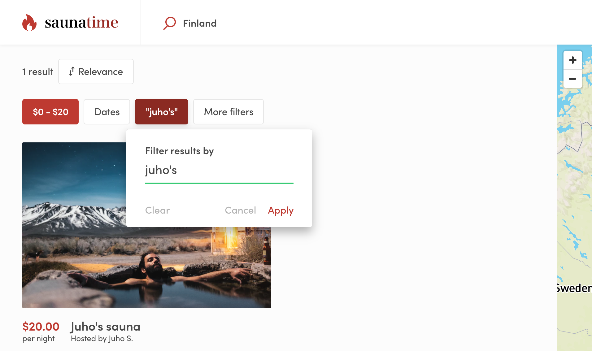

import { Callout } from 'nextra/components';

# Create custom search filters in Sharetribe Web Template

The search experience can be improved by adding search filters to narrow
down the results. The filters rely on listing indexed data.

There are 3 different UI contexts that render filters. On the mobile
layout, all filters are rendered to a modal inside the
`SearchFiltersMobile` component. On the desktop layout, the most
important filters are in `SearchFiltersPrimary`, and extra filters are
in `SearchFiltersSecondary` panel, which opens when user clicks the
_"More filters"_ button.

## Existing filter types

Sharetribe Web Template has several different filter types by default:
_BookingDateRangeFilter_, _KeywordFilter_, _PriceFilter_,
_SelectSingleFilter_ and _SelectMultipleFilter_. Select single and
select multiple filters are generic – they can be used to filter search
results using different kinds of data. The price and date range filters,
on the other hand, are only used for filtering by price and date range.
Listings with hourly bookings can also be filtered by their availability
in a date range with an optional minimum duration. Keyword filter is a
special case - more about that later.

_SelectSingleFilter_ and _SelectMultipleFilter_ can be used with
extended data. The _SelectSingleFilter_ can be used to filter out
listings with only one string value in a related public data field. For
instance, a listing's publicData attribute could contain an attribute
`condition: 'new'`. The related Marketplace API listing query could then
be made with the query parameter `pub_condition=new`.

The _SelectMultipleFilter_, on the other hand, can take multiple values
for a single search parameter. In this case, a listing entity could
contain public data `accessories: ['bell', 'lights', 'lock']` and the
query parameter to retrieve that listing among other search results
could be `pub_accessories=has_any:bell,mudguard`.

## Keyword filter

The keyword filter works a bit differently from the other filters. It
does filter search results, but it also sorts those results according to
how strongly the listing's data (title, description, and possible
extended data) correlates with the search string. Currently, there is no
decay function that would map keyword match correlation with distance to
`origin`, so the _origin_ param cannot be used at the same time as the
_keyword_ param. You can read more about how the keyword search works in
the related
[concepts article](/concepts/listings/how-the-listing-search-works/).



It is possible to remove location search from topbar and replace it with
the keyword search or use them together (without origin param). You can
configure the main search type in **src/config/configSearch.js**.

<Callout>

Search strings with only 1 or 2 letters have a longer timeout before the
search query is made.

</Callout>

## Creating your own filter types

If you are creating new filter components, note that we are using two
different types of components: **popup** and **plain**.

Popup components are rendered as primary dropdowns in the map search
view in `SearchFiltersPrimary` component.

Plain components are used on the grid search page and
`SearchFiltersMobile`, and with `SearchFiltersSecondary` on the map
search page. _SearchFiltersSecondary_ opens secondary filters in a
distinct panel in order to fit additional filters to the desktop search
view.

To make creating new filters easier, there are two generic components:
`FilterPopup` and `FilterPlain`. These components expect that you give
form fields as child component. This is a simplified example of how the
FilterPlain and FilterPopup components are used in
[SelectMultipleFilter.js](https://github.com/sharetribe/web-template/blob/main/src/containers/SearchPage/SelectMultipleFilter/SelectMultipleFilter.js):

```jsx filename="SelectMultipleFilter.js"
return showAsPopup ? (
  <FilterPopup {...filterPopupProps}>
    <GroupOfFieldCheckboxes
      className={css.fieldGroup}
      name={name}
      id={`${id}-checkbox-group`}
      options={options}
    />
  </FilterPopup>
) : (
  <FilterPlain {...filterPlainProps}>
    <GroupOfFieldCheckboxes
      className={css.fieldGroupPlain}
      name={name}
      id={`${id}-checkbox-group`}
      options={options}
    />
  </FilterPlain>
);
```

When you have your custom filter component ready, you need to add it to
**SearchPage/FilterComponent.js**:

```shell
└── src
    └── containers
        └── SearchPage
            └── FilterComponent.js
```
