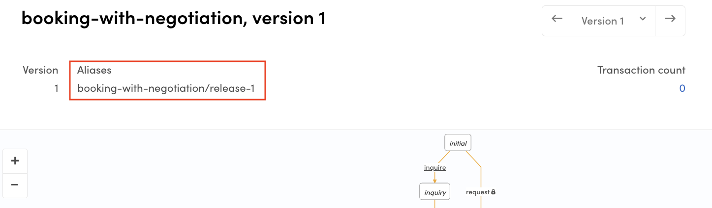
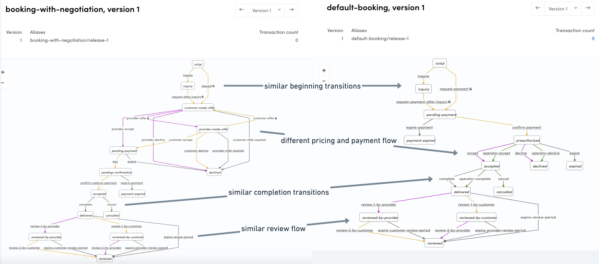

import { Callout, FileTree } from 'nextra/components';

# Change transaction process in Sharetribe Web Template

Sharetribe Web Template defines four transaction processes by default:

- daily, nightly, hourly, and fixed bookings use the **default-booking**
  process,
- product sales use the **default-purchase** process
- price negotiations use the **default-negotiation** process, and
- inquiries use the **default-inquiry** process.

The template is created to support states and transitions defined in
those processes.

How the transaction process works underneath the Marketplace API depends
on how your process is customised in our backend. To customise the
transaction process in the backend, you should use Sharetribe CLI. See
the
[Getting started with Sharetribe CLI](/introduction/getting-started-with-sharetribe-cli/)
tutorial to get familiar with the tool.

If you have changed the transaction process in your marketplace, or
added a new one to use in parallel with the existing ones, you should
check if your client app needs to be updated to match this different
transaction process. You can read more about how these processes work
from a background info article about the
[transaction process](/concepts/transactions/transaction-process/).

The following guide will help you to customise the process flow in the
template to match the process in our backend.

This guide assumes that you have already followed these instructions to
add a new process:

- [Create a new transaction process with the Sharetribe CLI](/how-to/transaction-process/create-new-transaction-process-with-cli/).

## Add a listing type that uses the transaction process

The
[src/config/configListing.js](https://github.com/sharetribe/web-template/blob/main/src/config/configListing.js)
file lists the listing types actively used by the template, as well as
the transaction processes related to those types. You need to add a
listing type configuration for a new transaction process into the
`listingTypes` array to use it in the template.

If you have not added any listing types in code before, the entries in
the listing type array are all commented out by default. They serve as
examples of what the listing type configuration looks like.

To add a new listing type, you can either replace or comment out any
previously active process definitions (if you only want to use the new
process) or leave them as they are (if you want to allow using multiple
processes in the same application).

```js filename="src/config/configListing.js"
export const listingTypes = [
  {
    listingType: 'booking-with-negotiation',
    label: 'Booking with negotiation',
    transactionType: {
      process: 'booking-with-negotiation',
      alias: 'booking-with-negotiation/release-1',
      unitType: 'night',
    },
  },
  // {
  //   listingType: 'daily-booking',
  //   label: 'Daily booking',
  //   transactionType: {
  //     process: 'default-booking',
  //     alias: 'default-booking/release-1',
  //     unitType: 'day',
  //   },
  //   availabilityType: 'oneSeat',
  //   defaultListingFields: {
  //     location: true,
  //     payoutDetails: true,
  //   },
  // },
  /* ... */
];
```

<Callout type="info">

Settings configured in local configurations files are overridden by any
fetched via the Asset Delivery API.

When you first add a new listing type in the configListing.js file, you
need to follow the steps in
[this article](/template/configuration/hosted-and-local-configurations/)
to modify the way your template merges local and hosted configurations.

</Callout>

The `alias` variable should point to the correct alias. You need to
check in Console which process and process version your client app
should support. All available transaction process aliases can be found
in the
[Build section](https://console.sharetribe.com/advanced/transaction-processes)
in Console.



The `unitType` specifies what kind of units the web app is dealing with
when handling the listing type. The Sharetribe Web Template recognises
and handles these unit types by default:

- **day**, **night**, **hour**, and **fixed** for the
  **default-booking** process
- **item** for the **default-purchase** process
- **inquiry** for the **default-inquiry** process
- **request** and **offer** for the **default-negotiation** process.

<Callout type="info">

The Sharetribe engine can handle other unit types besides the default
ones. If you use a unit type outside the defaults, you need to add
custom handling for it in e.g. line item calculation, order handling,
and email templates.

</Callout>

## Update the relevant files in src/transactions folder

Supported transaction processes are also defined in the files found in
`src/transactions` folder. In all cases, you will need to update the
`transaction.js` file to include your new process definition.

<FileTree>
  <FileTree.Folder name="src" defaultOpen>
    <FileTree.Folder name="transactions" defaultOpen>
      <FileTree.File name="transaction.js" />
    </FileTree.Folder>
  </FileTree.Folder>
</FileTree>

```jsx filename="src/transactions/transaction.js"
// Then names of supported processes
export const PURCHASE_PROCESS_NAME = 'default-purchase';
export const BOOKING_PROCESS_NAME = 'default-booking';
export const INQUIRY_PROCESS_NAME = 'default-inquiry';
export const NEGOTIATION_PROCESS_NAME = 'default-negotiation';
// Add new processes with a descriptive name
export const NEGOTIATED_BOOKING_PROCESS_NAME =
  'booking-with-negotiation';
```

In addition to updating the process name to your `transaction.js` file,
you will need to make sure the application has an accurate
representation of the different transitions and states in your new
transaction process. The transitions and states for the existing
processes are defined in the `transactionProcess....js` files in the
same `src/transactions` folder.

If you are replacing one of the default processes (for instance the
default booking process with a new booking process with different
transitions and states), you can modify the existing
**transactionProcessBooking.js** file to correspond to the new process.

If you are creating a parallel new process and want to allow listing
authors to choose between two processes for their listings, you will
need to create a new transaction process file and import it in
`transaction.js`.

### Determine which process files to work with

The best way to know which `transactionProcess...js` file to use as the
basis of your new one is to compare the transaction process graphs of
the two processes in the Console > Build > Advanced > Transaction
process visualiser view.

If two processes have mostly identical states and transitions with only
one or two exceptions, you can use the existing files of that process as
the basis for your new one with very little modification. The more
differences there are between two processes, the more you need to
customize the files. We recommend that you use the files of the existing
process that is closest to your new process.

For example, the image below shows a comparison between Sharetribe
example negotiated booking process and the default-booking process. You
can see that the main difference between the two flows is the pricing
and payment flow – in the default, the customer first pays and then the
provider either accepts or declines, whereas in the negotiated booking
flow, the parties first need to accept the suggested price and payment
happens after that. This means that the files related to the
`default-booking` process are a good starting point for implementing
this guide for that specific process.



<Callout type="info">
  The more your new process differs from existing processes, the more
  custom changes you will need to make to the presentational components
  and containers. You might have use cases in your transaction process
  that are not currently covered by the existing components and
  containers.
</Callout>

The following instructions specify the steps for modifying the existing
`transactionProcessBooking.js` file. If you do create a new one, we
recommend you replicate the existing default process file and make the
necessary changes instead of creating one from scratch.

### Update transitions and states

If the new transaction process has different transitions and states, you
should add (or remove) those. Transition names need to exactly match the
transitions used in Marketplace API, since transitions are part of
queried transaction entities.

You can find the names of your transaction process transitions and
states by viewing your process in Console > Build > Advanced >
Transaction process visualiser.


```diff filename="transactionProcessBooking.js"
export const transitions = {
  // When a customer makes a booking to a listing, a transaction is
  // created with the initial request-payment transition.
  // At this transition a PaymentIntent is created by Marketplace API.
  // After this transition, the actual payment must be made on client-side directly to Stripe.
- REQUEST_PAYMENT: 'transition/request-payment',
+ REQUEST: 'transition/request',

  // A customer can also initiate a transaction with an inquiry, and
  // then transition that with a request.
  INQUIRE: 'transition/inquire',
- REQUEST_PAYMENT_AFTER_INQUIRY: 'transition/request-payment-after-inquiry',
+ REQUEST_AFTER_INQUIRY: 'transition/request-after-inquiry',

+ PROVIDER_OFFER: 'transition/provider-offer',
  /* ... */
  EXPIRE_CUSTOMER_REVIEW_PERIOD: 'transition/expire-customer-review-period',
  EXPIRE_PROVIDER_REVIEW_PERIOD: 'transition/expire-provider-review-period',
  EXPIRE_REVIEW_PERIOD: 'transition/expire-review-period',
}

export const states = {
  INITIAL: 'initial',
  INQUIRY: 'inquiry',
+ CUSTOMER_MADE_OFFER: 'customer-made-offer',
+ PROVIDER_MADE_OFFER: 'provider-made-offer',
  PENDING_PAYMENT: 'pending-payment',
  PAYMENT_EXPIRED: 'payment-expired',
- PREAUTHORIZED: 'preauthorized',
  DECLINED: 'declined',
  ACCEPTED: 'accepted',
  EXPIRED: 'expired',
  CANCELED: 'canceled',
  DELIVERED: 'delivered',
  REVIEWED: 'reviewed',
  REVIEWED_BY_CUSTOMER: 'reviewed-by-customer',
  REVIEWED_BY_PROVIDER: 'reviewed-by-provider',
};

```

### Add or update state graph to match the new transaction process

State graph description makes it easier to understand how the
transaction process works - but even more importantly, it makes it
easier to create utility functions which tell you if a transaction has
reached a specific state. The description format follows
[Xstate](https://xstate.js.org/docs/), which is a Finite State Machine
(FSM) library. However, the library is not used since transitions in the
actual state machine are handled by Marketplace API.

```diff filename="src/transactions/transactionProcessBooking.js"
export const graph = {
  // id is defined only to support Xstate format.
  // However if you have multiple transaction processes defined,
  // it is best to keep them in sync with transaction process aliases.
- id: 'default-booking/release-1',
+ id: 'booking-with-negotiation/release-1',

  // This 'initial' state is a starting point for new transaction
  initial: states.INITIAL,

  // States
  states: {
    [states.INITIAL]: {
      on: {
        [transitions.INQUIRE]: states.INQUIRY,
-       [transitions.REQUEST_PAYMENT]: states.PENDING_PAYMENT,
+       [transitions.REQUEST]: states.CUSTOMER_MADE_OFFER,
      },
    },
    [states.INQUIRY]: {
      on: {
-       [transitions.REQUEST_PAYMENT_AFTER_INQUIRY]: states.PENDING_PAYMENT,
+       [transitions.REQUEST_AFTER_INQUIRY]: states.CUSTOMER_MADE_OFFER,
      },
    },
    // etc.
  },
};
```

When adding a new state, it needs to be added to the `states` property
of `graph`. Transitions from one state to another are defined in the
`on` property of a state. So, you need to add outbound transitions there
and inbound transitions to the `on` property of the previous state(s).

### Update graph helper functions to match the new process

Since the states and transitions in your state graph description have
changed, you will need to review all the helper functions in your
transaction process file and adjust them accordingly.

For example, if you have different privileged transitions in your
process than the ones in the default process, you will need to update
the helper function to feature the correct transitions. You can identify
privileged transitions in the transaction process graph by the lock icon
next to the transition name.

```diff filename="src/transactions/transactionProcessBooking.js"
export const isPrivileged = (transition) => {
  return [
-   transitions.REQUEST_PAYMENT,
-   transitions.REQUEST_PAYMENT_AFTER_INQUIRY,
+   transitions.CUSTOMER_OFFER,
+   transitions.PROVIDER_OFFER,
  ].includes(transition);
};
```

## Update state data for Inbox Page and Transaction Page

In addition to the transaction process file, there are two other places
where transaction process state data is handled: **InboxPage** and
**TransactionPage**. Both of those containers have files you will need
to review.

<FileTree>
  <FileTree.Folder name="src" defaultOpen>
    <FileTree.Folder name="containers" defaultOpen>
      <FileTree.Folder name="InboxPage" defaultOpen>
        <FileTree.File name="InboxPage.stateData.js" />
        <FileTree.File name="InboxPage.stateDataBooking.js" />
        <FileTree.File name="InboxPage.stateDataInquiry.js" />
        <FileTree.File name="InboxPage.stateDataNegotiation.js" />
        <FileTree.File name="InboxPage.stateDataPurchase.js" />
      </FileTree.Folder>
      <FileTree.Folder name="TransactionPage" defaultOpen>
        <FileTree.File name="TransactionPage.stateData.js" />
        <FileTree.File name="TransactionPage.stateDataBooking.js" />
        <FileTree.File name="TransactionPage.stateDataInquiry.js" />
        <FileTree.File name="TransactionPage.stateDataNegotiation.js" />
        <FileTree.File name="TransactionPage.stateDataPurchase.js" />
      </FileTree.Folder>
    </FileTree.Folder>
  </FileTree.Folder>
</FileTree>

Similarly to the `src/transactions` folder, you can either

- modify the existing state data file whose states and transitions most
  closely match your new process,
- or you can replicate the existing file into a new one and modify the
  new file

In both InboxPage and TransactionPage contexts, the `...stateData.js`
file compiles necessary transaction state information being used on the
page.

For instance, `TransactionPage` has an action button, and depending on
the transaction state and the user's role in the transaction, the button
may be used to accept or decline the transaction, or mark it as
delivered or received. This logic is determined in the process specific
`TransactionPage.stateData....js`. files. The following example is from
[TransactionPage.stateDataPurchase.js](https://github.com/sharetribe/web-template/blob/main/src/containers/TransactionPage/TransactionPage.stateDataPurchase.js):

```jsx filename="TransactionPage.stateDataPurchase.js"
// ConditionalResolver is basically a case structure
// that takes the process state and transaction role as parameters
return new ConditionalResolver([processState, transactionRole])
  .cond([states.INQUIRY, CUSTOMER], () => {
    const transitionNames = Array.isArray(nextTransitions)
      ? nextTransitions.map((t) => t.attributes.name)
      : [];
    const requestAfterInquiry =
      transitions.REQUEST_PAYMENT_AFTER_INQUIRY;
    const hasCorrectNextTransition = transitionNames.includes(
      requestAfterInquiry
    );
    const showOrderPanel =
      !isProviderBanned && hasCorrectNextTransition;
    return { processName, processState, showOrderPanel };
  })
  .cond([states.INQUIRY, PROVIDER], () => {
    return { processName, processState, showDetailCardHeadings: true };
  })
  .cond([states.PURCHASED, CUSTOMER], () => {
    // In the default purchase process, after the item has been purchased the customer
    // sees an action button to transition the transaction with 'mark-received-from-purchased'
    return {
      processName,
      processState,
      showDetailCardHeadings: true,
      showActionButtons: true,
      showExtraInfo: true,
      primaryButtonProps: actionButtonProps(
        transitions.MARK_RECEIVED_FROM_PURCHASED,
        CUSTOMER
      ),
    };
  })
  .cond([states.PURCHASED, PROVIDER], () => {
    // In the same state, the provider sees an action button to transition the transaction
    // with 'mark-delivered'. The component on the transaction page is the same, but the props are
    // resolved in this ...stateData... -file.
    const actionButtonTranslationId = isShippable
      ? `TransactionPage.${processName}.${PROVIDER}.transition-mark-delivered.actionButtonShipped`
      : `TransactionPage.${processName}.${PROVIDER}.transition-mark-delivered.actionButton`;

    return {
      processName,
      processState,
      showDetailCardHeadings: true,
      showActionButtons: true,
      primaryButtonProps: actionButtonProps(
        transitions.MARK_DELIVERED,
        PROVIDER,
        {
          actionButtonTranslationId,
        }
      ),
    };
  });
/*...*/
```

The main `...stateData.js` file imports functions from these process
specific files, such as `...stateDataBooking.js` and
`...stateDataPurchase.js`, to retrieve the state data corresponding to
the correct process.

```jsx filename="TransactionPage.stateData.js"
export const getStateData = (params) => {
  /* ... */
  if (processName === PURCHASE_PROCESS_NAME) {
    return getStateDataForPurchaseProcess(params, processInfo());
  } else if (processName === BOOKING_PROCESS_NAME) {
    return getStateDataForBookingProcess(params, processInfo());
  } else if (processName === INQUIRY_PROCESS_NAME) {
    return getStateDataForInquiryProcess(params, processInfo());
  } else if (processName === NEGOTIATION_PROCESS_NAME) {
    return getStateDataForNegotiationProcess(params, processInfo());
  } else {
    return {};
  }
};
```

If you have added a new process name constant besides the defaults
listed in the above example, you will need to import it in the two
`...stateData.js` files, as well as import the functions they need to
use for retrieving state data, so that your Inbox Page and Transaction
Page work correctly.

The process specific `...stateData` files (e.g. `...stateDataBooking.js`
and `...stateDataPurchase.js`) export a `getStateDataFor...` function,
which conditionally resolves the necessary props based on the
transaction state and the user role. You will need to check which
changes to make in the `ConditionalResolver`, for example if there are
new states that require specific props to be returned to the page based
on the state.

Depending on what props your user interface changes require, you may
need to also pass custom props that are not used in the default
processes.

```jsx filename="TransactionPage.stateDataNegotiatedBooking.js"
export const getStateDataForNegotiatedBookingProcess = (txInfo, processInfo) => {
  const { transaction, transactionRole, nextTransitions } = txInfo;
  const isProviderBanned = transaction?.provider?.attributes?.banned;
  const isCustomerBanned = transaction?.provider?.attributes?.banned;
  const _ = CONDITIONAL_RESOLVER_WILDCARD;

  const {
    processName,
    processState,
    states,
    transitions,
    isCustomer,
    actionButtonProps,
    leaveReviewProps,
  } = processInfo;

  return new ConditionalResolver([processState, transactionRole])
    .cond([states.INQUIRY, CUSTOMER], () => {
      const transitionNames = Array.isArray(nextTransitions)
        ? nextTransitions.map(t => t.attributes.name)
        : [];
      const requestAfterInquiry = transitions.REQUEST_AFTER_INQUIRY;
      const hasCorrectNextTransition = transitionNames.includes(requestAfterInquiry);
      const showOrderPanel = !isProviderBanned && hasCorrectNextTransition;
      return { processName, processState, showOrderPanel };
    })
    .cond([states.INQUIRY, PROVIDER], () => {
      return { processName, processState, showDetailCardHeadings: true };
    })
    .cond([states.CUSTOMER_MADE_OFFER, CUSTOMER], () => {
      return { processName, processState, showDetailCardHeadings: true, showExtraInfo: true };
    })
    .cond([states.CUSTOMER_MADE_OFFER, PROVIDER], () => {
      const primary = isCustomerBanned ? null : actionButtonProps(transitions.PROVIDER_ACCEPT, PROVIDER);
      const secondary = isCustomerBanned ? null : actionButtonProps(transitions.PROVIDER_DECLINE, PROVIDER);
      const tertiary = isCustomerBanned ? null : actionButtonProps(transitions.PROVIDER_OFFER, PROVIDER),
      return {
        processName,
        processState,
        showDetailCardHeadings: true,
        showActionButtons: true,
        primaryButtonProps: primary,
        secondaryButtonProps: secondary,
        tertiaryButtonProps: tertiary
      };
    })
    /* ... */
```

If you have created a new **stateData** file (e.g.
**TransactionPage.stateDataNegotiatedBooking.js**), you will need to
export a uniquely named _getStateDataFor..._ function from that file and
then use it in the `...stateData.js` file.

```diff filename="TransactionPage.stateData.js"
export const getStateData = params => {
  /* ... */
  if (processName === PURCHASE_PROCESS_NAME) {
    return getStateDataForPurchaseProcess(params, processInfo());
  } else if (processName === BOOKING_PROCESS_NAME) {
    return getStateDataForBookingProcess(params, processInfo());
  } else if (processName === INQUIRY_PROCESS_NAME) {
    return getStateDataForInquiryProcess(params, processInfo());
  } else if (processName === NEGOTIATION_PROCESS_NAME) {
    return getStateDataForNegotiationProcess(params, processInfo());
+ } else if (processName === NEGOTIATED_BOOKING_PROCESS_NAME) {
+   return getStateDataForNegotiatedBookingProcess(params, processInfo());
  } else {
    return {};
  }
}
```

## Update listing creation tabs

In the EditListingWizard component, listing editing tabs are defined by
transaction process.

<FileTree>
  <FileTree.Folder name="src" defaultOpen>
    <FileTree.Folder name="containers" defaultOpen>
      <FileTree.Folder name="EditListingPage" defaultOpen>
        <FileTree.Folder name="EditListingWizard" defaultOpen>
          <FileTree.File name="EditListingWizard.js" />
        </FileTree.Folder>
      </FileTree.Folder>
    </FileTree.Folder>
  </FileTree.Folder>
</FileTree>

Add the tabs you want to use for listings using this process.

```diff filename="EditListingWizard.js"
const tabsForListingType = (processName, listingTypeConfig) => {
  /* ... */
  const tabs = {
    ['default-booking']: [DETAILS, ...locationMaybe, PRICING, AVAILABILITY, ...styleOrPhotosTab],
+   ['booking-with-negotiation']: [DETAILS, ...locationMaybe, PRICING, AVAILABILITY, ...styleOrPhotosTab],
    ['default-purchase']: [DETAILS, PRICING_AND_STOCK, ...deliveryMaybe, ...styleOrPhotosTab],
    ['default-negotiation']: [DETAILS, ...locationMaybe, ...pricingMaybe, ...styleOrPhotosTab],
    ['default-inquiry']: [DETAILS, ...locationMaybe, ...pricingMaybe, ...styleOrPhotosTab],
  };

  return tabs[processName] || tabs['default-inquiry'];
};

```

## Add marketplace text strings

A lot of marketplace text strings in Sharetribe Web Template are
transaction process and state specific.

```jsx filename="src/translations/en.json"
/* ... */
  "InboxPage.default-booking.accepted.status": "Accepted",
  "InboxPage.default-booking.canceled.status": "Canceled",
  "InboxPage.default-booking.declined.status": "Declined",
  "InboxPage.default-booking.delivered.status": "Delivered",
/* ... */
```

This means that when you create a new transaction process, you will also
need to add marketplace texts for the relevant keys and states in the
new process. You can add the process specific keys either into the
[bundled marketplace text files in the template](/template/content-management/how-to-change-bundled-marketplace-texts/)
or through the
[Sharetribe Console > Build > Content > Marketplace texts section](https://www.sharetribe.com/help/en/articles/8404720-how-to-edit-marketplace-texts).

After making the necessary changes in these contexts, your new
transaction process should work as expected in the Template! Be sure to
test all the steps in your transaction process carefully to make sure
that all cases show up as you would expect.

## Add error handling on user deletion

Because the Template offers support for users to delete their accounts,
you will also need to ensure that newly created transaction processes
(or modified ones) are properly checked at the time of deletion for
states that contain Stripe-related payment processing. This is handled
in
[delete-account.js](https://github.com/sharetribe/web-template/blob/main/server/api/delete-account.js).

If you have modified an existing transaction process, ensure that all
states containing Stripe-related actions have been included in the
appropriate array. See the default booking configuration for example:

```jsx filename="server/api/delete-account.js"
const stripeRelatedStatesForBookings = [
  'state/pending-payment',
  'state/preauthorized',
  'state/accepted',
  'state/delivered',
];
```

Alternatively, if you have added an entirely new transaction process
then you will need to create a new array and add it to the queue to be
checked before submitting the user deletion request.

```diff filename="server/api/delete-account.js"
+ stripeRelatedStatesForNegotiatedBookings = [
+   // ...add the relevant states
+ ];

+ const ongoingNegotiatedBookingsWithIncompletePaymentProcessing = () =>
+     sdk.transactions.query({
+       processNames: 'booking-with-negotiation',
+       states: stripeRelatedStatesForNegotiatedBookings.join(','),
+     });

 Promise.all([
    /* ... */
+     ongoingNegotiatedBookingsWithIncompletePaymentProcessing(),
  ])
  /* ... */
};
```

This handles throwing an error if the user attempts to delete their
account while any of their involved transactions have ongoing Stripe
payment processing. This also ensures that no expensive, unnecessary
user deletion API calls are made, and that the user is prompted to
contact the marketplace rather than receiving an unclear or confusing
error.

## Summary

Adding a new transaction process always requires changes in your client
application. This article offers a starting point to adding your new
process to the transaction process configuration and state handling.

If your new process is very similar to one of the existing default
processes, you may be able to implement by making the default changes to
configuration and state handling. However, if your process is complex or
it differs significantly from any of the existing processes, you will
also need to carefully test the user experience and likely add new logic
for the containers and components as well.
