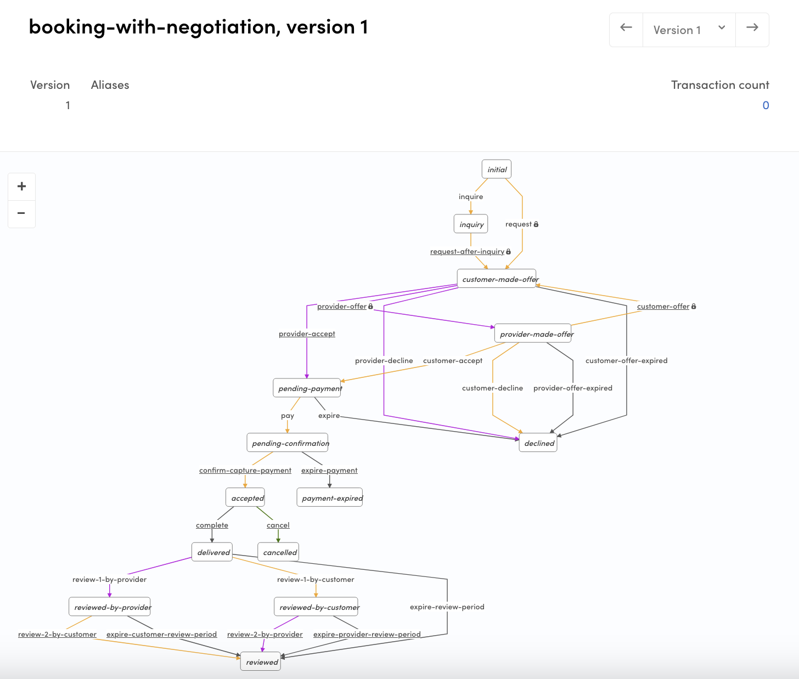

import { Callout } from 'nextra/components';

# Create a new transaction process with the Sharetribe CLI

In this guide, we'll create a new transaction process for your
marketplace. We will use the negotiated booking process, where the
customer and provider first negotiate on the price of the booking before
the customer makes the payment.

<Callout type="info">

Sharetribe CLI (Command-line interface) is a tool for changing your
marketplace's configurations such as transaction processes and email
templates.

This guide expects that you have already installed Sharetribe CLI and
are logged in with your API key. It's recommended to first read the
tutorial
[Getting started with Sharetribe CLI](/introduction/getting-started-with-sharetribe-cli/).
If you haven't read
[how transaction processes work in Sharetribe](/concepts/transactions/transaction-process/),
it's a good idea to do that before starting this guide.

</Callout>

If you want to edit an existing transaction process instead, you can
follow these instructions to edit your transaction process:

- [Edit a transaction process with Sharetribe CLI](/how-to/transaction-process/edit-transaction-process-with-sharetribe-cli/)

## Clone Sharetribe example processes repository

When you are creating a new transaction process, you can either write
your process from scratch, or you can use existing processes as your
starting point. Since we are using one of Sharetribe's example processes
in this guide, we will start by cloning the Sharetribe example processes
repository:

```shell
git clone https://github.com/sharetribe/example-processes.git
```

## Create a new process

To get up and running with Sharetribe CLI, see the
[Getting started with Sharetribe CLI](/introduction/getting-started-with-sharetribe-cli/)
guide in Dev Docs.

Let's see what the subcommand `help` tells us about `process create`:

```shell
$ flex-cli help process create
create a new transaction process

USAGE
  $ flex-cli process create

OPTIONS
  --path=LOCAL_PROCESS_DIR          path to the directory where the process.edn file is
  --process=PROCESS_NAME            name for the new process that is created
  -m, --marketplace=MARKETPLACE_ID  marketplace identifier
```

To create a new process, we need to specify a path to the local
directory. That directory should contain two things:

- the process definition (process.edn file) and
- a `templates` subdirectory containing correct email templates for the
  email notifications defined in that process.

We already have those since we cloned the _example-processes_
repository. If you are creating your own transaction process, make sure
that you are including both the `process.edn` file and the `templates`
directory in your process directory.

In addition, we need to define a name for the process and the target
marketplace environment. You can use the same process name, for example
_"negotiated-booking"_, or you can name it something different, such as
_"booking-with-negotiation"_. For clarity, in this example we'll use a
different name for the new process.

```shell
flex-cli process create --path=./negotiated-booking --process=booking-with-negotiation -m=my-marketplace-dev
```

After executing that command, you can go to the Sharetribe Console:
_Build > Advanced > Transaction process visualizer_ and see that the
_"booking-with-negotiation"_ process is there.



## Create a process alias

The process is created, but we still can't reference that process from
our client app, since it doesn't have process alias set. We can create
an alias for our new process with Sharetribe CLI command:

```shell
flex-cli process create-alias --process=booking-with-negotiation --version=1 --alias=release-1 -m=my-marketplace-dev
```

With that command, we are creating a new alias _"release-1"_ and point
it to the previously created process and its version 1.

After that you should see the alias in the Console:<br />
`booking-with-negotiation/release-1`.


Now, you can initiate transactions with this process using the API or
SDK!

## Summary

In this guide, you added a new transaction process in your Sharetribe
marketplace environment, and set an alias to the process so you can
reference it with the API.

If you are using the Sharetribe Web Template, you also need to modify
your client app to use this process. You can follow the steps in this
guide to do that:

- [Change transaction process in Sharetribe Web Template](/how-to/transaction-process/change-transaction-process-in-template/)
