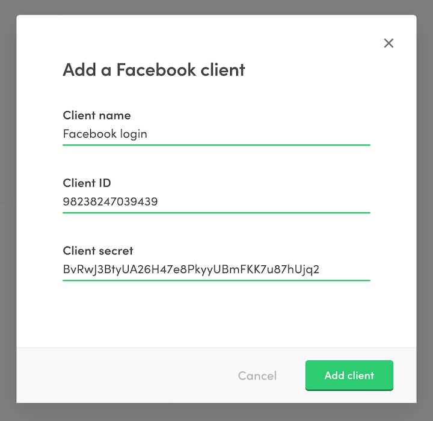

import { Callout, Steps } from 'nextra/components';

# Enable Facebook login

Enabling Facebook login consists of three main steps:

- **Create a Facebook app** Facebook app is what connects your
  marketplace to Facebook and lets Facebook know that users from your
  marketplace are allowed to authenticate themselves using the Facebook
  login.
- **Create an identity provider client in Sharetribe Console** Identity
  provider (IdP) client is what let's Sharetribe know that the users of
  your marketplace are allowed to use the Facebook app you created to
  log into your marketplace.
- **Add environment variables to the Sharetribe Web Template** A few
  attributes from the Facebook app will need to be configured to your
  Sharetribe Web Template so that it can perform the login flow via
  Facebook.

<Callout type="important">
  Facebook Login can be configured without code if you are running a
  no-code marketplace. If you are hosting the template yourself, you
  will need to follow the instructions on this page. Compared to no-code
  marketplaces, the key difference is that you **need to configure the
  Client Secret using environment variables** instead of configuring the
  value via Console.
</Callout>

## Create a Facebook app

The first thing to do is to create a Facebook development app for your
marketplace by following
[these steps in the Sharetribe help center](https://www.sharetribe.com/help/en/articles/9174337-how-to-enable-facebook-login#h_3848596b4d).

## Configure an identity provider client in Console

Now that your Facebook app is all set up, a corresponding _identity
provider client_ will need to be configured for your marketplace. This
will tell Sharetribe that your users will be allowed to log into your
marketplace using the Facebook app you just created. The information
stored in an IdP client is used to verify a token obtained from Facebook
when a user logs in.

An identity provider client can be configure with the following steps:

<Steps>

{<h3></h3>}

Go to
[Social logins & SSO in Console](https://console.sharetribe.com/advanced/social-logins-and-sso).

{<h3></h3>}

Under _Identity provider clients_ click "+ Add new".

{<h3></h3>}

Set "Client name". This can be anything you choose, for example,
"Facebook login". In case you need to create multiple Facebook apps,
this will help you make a distinction between the corresponding IdP
clients.

{<h3></h3>}

Set the _Client ID_. This value is the App ID from your Facebook app.
You can see the value under _Settings > Basic_ in the Facebook app view.

{<h3></h3>}

Set the _Client secret_. This value is the App secret in your Facebook
app. You can see the value under _Settings > Basic_ in the Facebook app
view. You will need to authenticate to reveal the secret value.

<Callout type="important">
  You will also need to configure the Client secret and the Client ID as
  environment variables.
</Callout>

The IdP client configuration should now look something like this:

{<h3></h3>}

Click "Add client" and your identity provider client is ready.

</Steps>

## Add environment variables

Last step to enabling Facebook login is to configure your Sharetribe Web
Template with the values that you used to add an identity provider
client in Console. Add the following environment variables to your
template:

- **`REACT_APP_FACEBOOK_APP_ID`** The App ID of your Facebook app. You
  can see the value under Settings > Basic in the Facebook app view.
  Also corresponds to _Client ID_ value of the identity provider in
  Console.
- **`FACEBOOK_APP_SECRET`** The App Secret of your Facebook app. Also
  corresponds to _Client secret_ value of the identity provider in
  Console.

<Callout type="info">
  Remember to redeploy your app or restart your development environment
  after making changes to environment variables!
</Callout>

For more information on the template environment variables, see the
[Template environment variables](/template/configuration/template-env/)
article.

That is it. Setting these environment variables will make Sharetribe Web
Template render the Facebook login button in signup and login forms.
