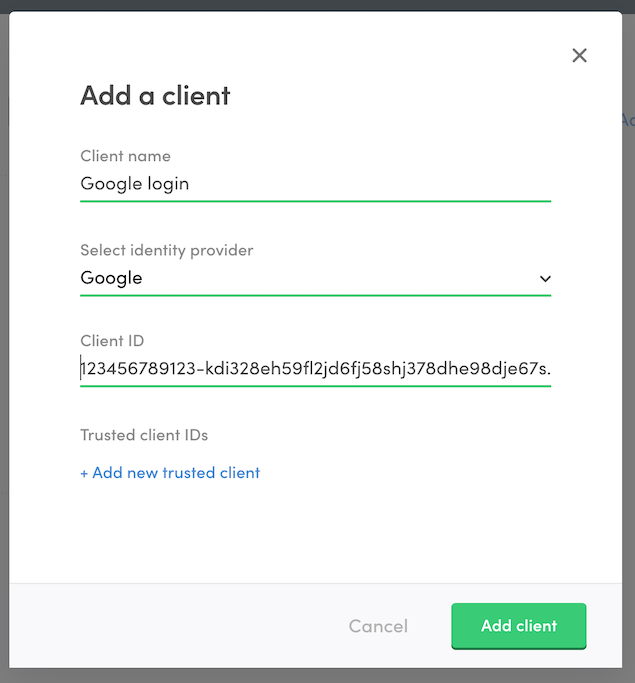

import { Callout, Steps } from 'nextra/components';

# Enable Google login

Enabling Google login consists of three main steps:

- **Create a Google Sign-In Project** Google Sign-In Project is what
  connects your marketplace to Google and let's Google know that users
  from your marketplace are allowed to authenticate themselves using the
  Google Sign-In.
- **Create an identity provider client in Sharetribe Console** Identity
  provider (IdP) client is what let's Sharetribe know that the users of
  your marketplace are allowed to use the Google Sign-In Project you
  created to log into your marketplace.
- **Add environment variables to the Sharetribe Web Template** A few
  attributes from the Sign-In Project will need to be configured to
  Sharetribe Web Template so that it can perform the login flow via
  Google.

<Callout type="important">
  Google Login can be configured without code if you are running a
  no-code marketplace. If you are hosting the template yourself, you
  will need to follow the instructions on this page. Compared to no-code
  marketplaces, the key difference is that you **need to configure the
  Client Secret using environment variables** instead of configuring the
  value via Console.
</Callout>

## Create a Google Sign-In Project

The first thing to do is to create a Google Sign-In project for your
marketplace by following
[these steps in the Sharetribe help center](https://www.sharetribe.com/help/en/articles/9174430-how-to-enable-google-login#h_1e6314ef08).

## Configure an identity provider client in Console

Now that your Google Sign-In project is all set up, you will need to
configure a corresponding _identity provider client_ for your
marketplace. This will tell Sharetribe that your users will be allowed
to log into your marketplace using the Google Sign-In you just created.
The information stored in an IdP client is used to verify a token
obtained from Google when a user logs in.

An identity provider client can be configure with the following steps:

<Steps>

{<h3></h3>}

Go to
[Social logins & SSO in Console](https://console.sharetribe.com/advanced/social-logins-and-sso).

{<h3></h3>}

Under _Identity provider clients_ click "+ Add new".

{<h3></h3>}

Set "Client name". This can be anything you choose, for example, "Google
login".

{<h3></h3>}

Under "Select identity provider", pick "Google".

{<h3></h3>}

Set the _Client ID_. This value is the Client ID from your Google
Sign-In project. You can see the value under _Credentials > OAuth 2.0
client IDs_. Make sure you have the project you just created selected
from the top bar in Google developer console. In case you have multiple
clients configured in Google Sign-In, use the client ID of your _Web
application_ client here. See the next step for more information.

The IdP client configiruation should now look something like this:

{<h3></h3>}

If you have more than one client configured in your Google Sign-In
project, mobile clients for example, add the additional client IDs to
the same identity provider client under "Trusted client IDs" by clicking
"+ Add new trusted client". In case you are using two distinct Google
Sign-In projects, configure those as distinct clients in Console but
always bundle all the client IDs of a single project into one identity
provider client in Sharetribe Console.

{<h3></h3>}

Click "Add client" and your identity provider client is ready.

</Steps>

## Add environment variables

Last step to enabling Google login is to configure your Sharetribe Web
Template with the values that you used to add an identity provider
client in Console. Add the following environment variables to the
template:

- **`REACT_APP_GOOGLE_CLIENT_ID`** The Client ID of your Google Sign-In.
  You can see the value under _Credentials > OAuth 2.0 client IDs_ in
  your Google Sign-In project. Also corresponds to _Client ID_ value of
  the Identity provider client you created in Console.
- **`GOOGLE_CLIENT_SECRET`** The Client Secret of your Google Sign-In.

<Callout type="info">
  Remember to redeploy your app or restart your development environment
  after making changes to environment variables!
</Callout>

For more information on the template environment variables, see the
[Template environment variables](/template/configuration/template-env/)
article.

That is it. Setting these environment variables will make Sharetribe Web
Template render the Google login button in signup and login forms.
