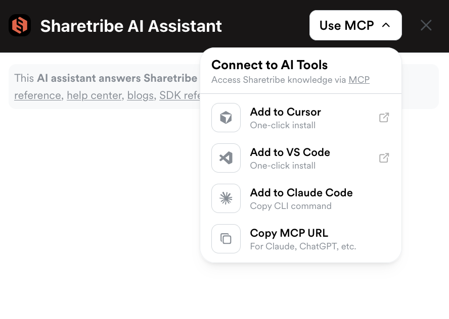

import { Tabs } from 'nextra/components';

# Build with AI

Sharetribe provides an AI assistant in our developer documentation. You
can use the related MCP to connect our documentation to your AI coding
assistant

In this guide, you will learn how to connect the developer documentation
MCP to your coding assistant

## Sharetribe developer documentation MCP

The developer documentation MCP uses information from the same sources
as the documentation AI assistant

- Dev Docs
- API and SDK references
- Sharetribe Developer Blog
- Sharetribe's Github repositories for the Sharetribe Web Template and
  Integration API examples
- selected articles from the Sharetribe Help Center

### MCP tool

The developer documentation MCP offers one MCP tool:

```
search_sharetribe_knowledge_sources
```

This tool initiates a search of the information sources listed above,
and returns the most relevant content for the query.

### Setup

When you open the Sharetribe developer docs AI assistant, you can see a
button in the top right corner with the text "Use MCP". Clicking this
button will show you shortcuts to add the documentation MCP to Cursor,
VS Code, and Claude Code, as well as copy the MCP URL
`https://sharetribe.mcp.kapa.ai` to use the MCP in other tools.



Setup steps vary depending on which client you are using.

{/* prettier-ignore */}
<Tabs items={['Claude Code', 'Claude Desktop', 'ChatGPT Desktop', 'Cursor', 'VS Code', 'Other']}>
  <Tabs.Tab>
  
Run the following command in your terminal:

```
claude mcp add --transport http sharetribe-docs https://sharetribe.mcp.kapa.ai
```

Then run the `/mcp` command in Claude Code, and follow the steps in your
browser to authenticate.

For more information, see the
[Claude Code MCP documentation](https://docs.anthropic.com/en/docs/claude-code/mcp).

  </Tabs.Tab>
  <Tabs.Tab>

Add to your Claude Desktop config file:

**macOS**:
`~/Library/Application Support/Claude/claude_desktop_config.json`

**Windows**: `%APPDATA%\Claude\claude_desktop_config.json`

```shell filename="claude_desktop_config.json"
{
  "mcpServers": {
    "sharetribe-docs": {
      "command": "npx",
      "args": ["mcp-remote", "https://sharetribe.mcp.kapa.ai"]
    }
  }
}
```

Restart Claude Desktop for changes to take effect.

For more details, see the
[Claude Desktop documentation](https://support.anthropic.com/en/articles/9487310-desktop-app).

  </Tabs.Tab>
  <Tabs.Tab>

ChatGPT Desktop supports MCP servers in developer mode:

1. Open ChatGPT Desktop.
2. Go to Settings > Features.
3. Enable Developer mode.
4. Navigate to Settings > MCP Servers.
5. Click Add Server and enter:
   - Name: `sharetribe-docs`
   - URL: `https://sharetribe.mcp.kapa.ai`

For more information, see the
[ChatGPT Developer mode documentation](https://platform.openai.com/docs/guides/developer-mode).

  </Tabs.Tab>
  <Tabs.Tab>

Add the following to your .cursor/mcp.json file:

```shell filename=".cursor/mcp.json"
{
  "mcpServers": {
    "sharetribe-docs": {
      "type": "http",
      "url": "https://sharetribe.mcp.kapa.ai"
    }
  }
}
```

For more information, see the
[Cursor MCP documentation](https://docs.cursor.com/context/model-context-protocol).

  </Tabs.Tab>
  <Tabs.Tab>

Prerequisites: VS Code 1.102+ with GitHub Copilot enabled.

Create an `mcp.json` file in your workspace `.vscode` folder:

```shell filename=".vscode/mcp.json"
{
  "servers": {
    "sharetribe-docs": {
      "type": "http",
      "url": "https://sharetribe.mcp.kapa.ai"
    }
  }
}
```

For more details, see the
[VS Code MCP documentation](https://code.visualstudio.com/docs/copilot/customization/mcp-servers).

  </Tabs.Tab>
  <Tabs.Tab>

MCP is an open protocol supported by many clients. Use the server URL
`https://sharetribe.mcp.kapa.ai` and refer to your client's
documentation for setup instructions.

Most clients accept the standard MCP JSON configuration format:

```
{
  "mcpServers": {
    "sharetribe-docs": {
      "url": "https://sharetribe.mcp.kapa.ai"
    }
  }
}
```

  </Tabs.Tab>
</Tabs>
{/* // prettier-ignore */}

And that's it! You're ready to use the Sharetribe developer
documentation MCP to speed up your AI assisted development!
